## AARNet eResearch Australasia 2025 Workshop - Advanced Globus

## Overview

In this half-day workshop, we will be exploring some advanced Globus configurations. At the conclusion of the workshop, you should be able to:

- Run Ansible to create Globus Endpoints, Data Transfer Nodes, Storage Gateways, and Mapped Collections
- Create Globus User Apps and Client Apps, and understand the difference between the two
- Use tools like Jupyter Notebooks to run Globus the Globus SDK
- Implement automated workflows using Globus Flows to streamline your data processing and management tasks
- Use Globus Compute to schedule jobs in HPC environments
<!-- - Set up custom user mappings for Globus authentication on local resources and optimise security settings -->
<!-- - Use connectors to interface Globus with storage systems other than Posix (e.g. S3) -->
If time permits, we hope to have an round-table discussion of real-life Globus use-cases.

Note that there is a shared document for the workshop [https://tinyurl.com/eRA25-Globus](https://tinyurl.com/eRA25-Globus). 

Please enter your name against an IP address for the session you are in - that will be your virtual machine for the session.

You will be able to add questions on notice to the document if we don't have time to answer them interactively during the workshop.

## Workshop Prerequisites

You will need to bring the following to the workshop:

- A laptop with the ability to connect to an AWS EC2 instance via SSH in order to complete the hands-on sections of the workshop. Please ensure that your firewall permits outbound SSH access to arbitrary IP addresses. Power and WiFi will be provided.
- A valid educational or research institution account to gain access to Globus (must be available in [EduGain](https://edugain.org/) via the [Australian Access Federation (AAF)](https://aaf.edu.au/)) or [Tuakiri](https://www.reannz.co.nz/products-and-services/tuakiri/). A list of AAF institutions is available [here](https://aaf.edu.au/subscribers/), and Tuakiri [here](https://www.reannz.co.nz/membership/members/). Alternatively, you can also use ORCID, GitHub or Google to access Globus for the workshop.
- Sufficient familiarity with the Linux command line so that you are able to perform basic command line operations, edit text files, and install packages. If you are completely unfamiliar with Linux, you will still benefit from attending the workshop, but you may need assistance with the hands-on sections. Please let us know beforehand if you are likely to require this assistance.

To get the most out of this workshop, you should already be able to:

- Know what Globus is and the benefits it provides for researchers
- Use the Globus web interface to transfer files between collections
- Understand the high-level architecture of Globus
- Install Globus Connect Personal software and set up a local endpoint with collections
- Install Globus Connect software on a Linux host and set up an endpoint with collections
- Configure Globus Storage Gateways and Collections for fine-grained access control
- Know how to monitor user activity on your collections

These skills were covered in the half-day ["Introduction to Globus" workshop](../introduction_to_globus_workshop/) run by AARNet at eResearch Australasia in 2024, and also in the morning session before this afternoon workshop.

Please contact alex.ip@aarnet.edu.au, steele.cooke@aarnet.edu.au or chris.myers@aarnet.edu.au if you are unsure about any of the above requirements.

## Agenda
### PART I
#### PRELUDE (15-20 minutes) - Sara
##### Housekeeping - fire exits, break times + laptop checks
##### Acknowledgement of Country
##### Introductions - instructors, helpers + how to participate
##### Plan for the afternoon - aims, learning objectives, timing (3 x 60min sessions + afternoon tea break)

### GLOBUS AUTOMATION (60mins) - Alex, Chris and Steele
##### Quick Review of Globus System Architecture

##### Setting up a Globus Endpoint automatically using Ansible

##### Registering a Globus User App (for scripts to be run by users)

##### Setting up a Globus Service User by registering a Client App

##### Using the Globus SDK to automate the creation and population of guest collections

##### Running Jupyter notebooks using your User App and Client App

### GLOBUS FLOWS AND COMPUTE (2 X 60mins) - Dr Kyle Chard, Director of Research at Globus

##### Implementing automated workflows using Globus Flows to streamline your data processing and management tasks

##### Using Globus Compute to schedule jobs in HPC environments

### Open Discussion (15-20 minutes)
- Introduce Globus Community Australasia
- Specific use Cases

### TOPICS TO BE COVERED IN FUTURE ONLINE SESSIONS (Apologies if you especially wanted them covered here)

##### Using connectors to interface Globus with storage systems other than Posix (e.g. S3)

##### Setting up custom user mappings for Globus authentication on local resources and optimise security settings

## Quick Review of Globus System Architecture
Below is a high-level diagram of the major components of the Globus system.


### Definitions
#### Endpoint
A logical construct that identifies an instance of Globus Connect to the Globus service. Each endpoint is registered with Globus and receives a new DNS record. An endpoint aggregates one or more Data Transfer Nodes.

#### Data Transfer Node (DTN)
A physical manifestation of the endpoint. More DTNs for an endpoint mean a larger physical footprint and better resilience and performance. Each DTN has a unique IP address which is registered with the Globus and the DNS record for the endpoint.

#### Connector
A software package that implements an interface allowing the Globus service to access a specific storage system (e.g. POSIX, S3, etc). Note that users will never interact directly with a connector. Note also that POSIX is supported by default, and additional connectors may entail an extra cost.

#### Storage Gateway
An instance of a Globus Connector configured to access a storage system using specified policies (valid IDPs, path restrictions, etc.).

#### Collection
A logical construct that allows a user to access data via the Globus service (constrained by the underlying Storage Gateway). One could think of this as a "projection" of part or all of a storage system via the Globus service.

#### UUID
A Universally Unique Identifier (UUID) is a 128-bit label used for information in computer systems. The term Globally Unique Identifier (GUID) is also used, mostly in Microsoft systems. Every Globus entity is assigned a UUID, which looks like the following:
```
a3f0c02a-866a-472e-8f13-248360e296f7
```
These UUIDs are used by Globus to uniquely identify resources, so they are particularly important in the context of automation. They can also be used to search for endpoints or collections in the Web UI.


## Setting up a Globus Endpoint, Storage Gateway and Mapped Collection automatically using Ansible
The first exercise in the workshop will be the creation of a Globus endpoint, storage gateway and mapped collection on your workshop VM from scratch using a
pre-configured service user with manager rights on the AARNet workshop subscription. We will cover the creation of service users later in this workshop.

We have published an Ansible script to automate the setup of a Globus endpoint, storage gateway and mapped collection. The original Ansible code can
be found [here](https://github.com/AARNet/Globus-Community/tree/main/code/examples/globus_ansible), but we have already preconfigured it as much as possible
on your workshop VM.

__Please change directory to `~/globus_community_ansible` and enter `git pull` to update your repo with any late-breaking changes to the Globus Community Australasia repo__

For this workshop, you will find the ansible code in your home directory ~/globus_ansible. We have already set up the files `~/globus_community_ansible/inventory/all.yml` and `~/globus_community_ansible/inventory/host_vars/globus-test-host.yml` with your public IP address for you and created a service user, 
but you will need to edit the file `~/globus_community_ansible/roles/globus/defaults/main.yml` with your user details.

Specifically, you will need to provide values for these at the top of the file `~/globus_community_ansible/roles/globus/defaults/main.yml`:

To obtain the value for `workshop_globus_user_uuid`, we will use the Globus CLI as follows:

'''bash
globus login
'''
This will bring up a URL which you will need to copy and paste into your browser. Complete the login process as your user, and then paste the resulting code at the
prompt and hit enter.
```
Please authenticate with Globus here:
------------------------------------
https://auth.globus.org/v2/oauth2/authorize?client_id=70e7b4e2-9a56-4bb8-a6fe-857582e4ab46&redirect_uri=https%3A%2F%2Fauth.globus.org%2Fv2%2Fweb%2Fauth-code&scope=openid+profile+email+urn%3Aglobus%3Aauth%3Ascope%3Aauth.globus.org%3Aview_identity_set+urn%3Aglobus%3Aauth%3Ascope%3Atransfer.api.globus.org%3Aall+urn%3Aglobus%3Aauth%3Ascope%3Agroups.api.globus.org%3Aall+urn%3Aglobus%3Aauth%3Ascope%3Asearch.api.globus.org%3Aall+https%3A%2F%2Fauth.globus.org%2Fscopes%2F524230d7-ea86-4a52-8312-86065a9e0417%2Ftimer%5Burn%3Aglobus%3Aauth%3Ascope%3Atransfer.api.globus.org%3Aall%5D+https%3A%2F%2Fauth.globus.org%2Fscopes%2Feec9b274-0c81-4334-bdc2-54e90e689b9a%2Fmanage_flows+https%3A%2F%2Fauth.globus.org%2Fscopes%2Feec9b274-0c81-4334-bdc2-54e90e689b9a%2Fview_flows+https%3A%2F%2Fauth.globus.org%2Fscopes%2Feec9b274-0c81-4334-bdc2-54e90e689b9a%2Frun_status+https%3A%2F%2Fauth.globus.org%2Fscopes%2Feec9b274-0c81-4334-bdc2-54e90e689b9a%2Frun_manage&state=_default&response_type=code&access_type=offline&prompt=login
------------------------------------

Enter the resulting Authorization Code here:
```
Once you have logged into the CLI, you can use the following command to find the UUID for your username as follows:
```bash
globus get-identities someuser@gmail.com
```
This will bring up the UUID for the Globus user, which will look like this:
```
71fe5bdc-a52c-4096-bd0e-d0f6542208c2
```

The values at the top of the file `~/globus_community_ansible/roles/globus/defaults/main.yml` should look something like this after you've filled them in.
```
---
# WORKSHOP USER TO FILL THESE IN
workshop_globus_user: 'someuser@gmail.com'
workshop_globus_user_uuid: '71fe5bdc-a52c-4096-bd0e-d0f6542208c2'
workshop_globus_user_domain: 'gmail.com'
```

Once you have filled in these details, make sure you are in `~/globus_community_ansible` and enter in the following Ansible command:

```bash
ANSIBLE_ROLES_PATH=./roles ansible-playbook -i inventory/all.yml --user workshop-user --private-key ~/.ssh/id_ssh_rsa --ask-become-pass playbooks/globus.yml
```

Paste in your workshop-user password when you see the `BECOME passowrd:` prompt.

The first time you SSH to localhost, you will see the following:
```
The authenticity of host 'localhost (::1)' can't be established.
ED25519 key fingerprint is SHA256:5ZJFCUDyMml5eDLJz1jfhiD/BJE3YSmz3KGHre5wySg.
This key is not known by any other names
Are you sure you want to continue connecting (yes/no/[fingerprint])?
```

Enter `yes` and hit the `Enter` key to continue.

__The Ansible will take just under ten minutes to run, so, in the interests of time, we may skip ahead to the next section and come back when it's finished.__

After a while, the Ansible should run to completion. The last couple of lines should be a summary of the Ansible run with no failures similar to this:

```
PLAY RECAP ********************************************************************************************************************************************************************************************************************************************************************************************************************************************************************************************************************************
globus-workshop-host       : ok=30   changed=3    unreachable=0    failed=0    skipped=31   rescued=0    ignored=0

```

__Congratulations! You have just automagically done in a few minutes what we took most of the first workshop session doing!__

You can check what you have done using the `globus-connect-server` utility. First you will need to log in:
```bash
globus-connect-server login localhost
```
Note that your session will stay active for the duration of the workshop, so you won't need to do this again.

Now you can look at the endpoint, storage gateway(s) and collection(s) using the following commands:
```bash
globus-connect-server endpoint show
globus-connect-server storage-gateway list
globus-connect-server collection list
```
You should see something like the following:
```
[workshop-user@ip-10-0-3-134 globus_community_ansible]$ globus-connect-server endpoint show
Display Name:       Advanced Globus Workshop Ansible Auto-Deployment
ID:                 da27e302-2e3e-4b85-b3b2-3627781b2892
Subscription ID:    None
Public:             True
GCS Manager URL:    https://c2e8ac.03c0.gaccess.io
Network Use:        normal
Organization:       AARNet
Department:         eResearch
Keywords:           ['AARNet', 'workshop', 'Australia', 'GLOBUS']
Contact E-mail:     alex.ip@aarnet.edu.au
Endpoint Info Link: https://www.aarnet.edu.au/globus

[workshop-user@ip-10-0-3-134 globus_community_ansible]$ globus-connect-server storage-gateway list
Display Name                                                   | ID                                   | Connector | High Assurance | MFA
-------------------------------------------------------------- | ------------------------------------ | --------- | -------------- | -----
Advanced Globus Workshop Ansible Auto-Deployment POSIX Gateway | bc44519c-ab1f-4b6c-8ef5-9d1912b38916 | POSIX     | False          | False

[workshop-user@ip-10-0-3-134 globus_community_ansible]$ globus-connect-server collection list
ID                                   | Display Name                                                                            | Owner                                                        | Collection Type | Storage Gateway ID                   | Created    | Last Access
------------------------------------ | --------------------------------------------------------------------------------------- | ------------------------------------------------------------ | --------------- | ------------------------------------ | ---------- | -------------
31bb52a1-c15f-4e0c-bd64-19aaad613e52 | Advanced Globus Workshop Ansible Auto-Deployment POSIX Gateway Public Mapped Collection | 093fb7ae-9f4c-4e79-b0c4-5f7847ac4f68@clients.auth.globus.org | mapped          | bc44519c-ab1f-4b6c-8ef5-9d1912b38916 | 2025-09-10 | Not supported
```

__Pro tip: Use the collection UUID in the Globus web app instead of the collection display name to go straight to it.__

## Authentication
In order to run our script to create guest collections and transfer files as a user, we will need to set up a Globus user app in the web UI.

### Definitions
To use the API, we will need to authenticate with Globus. Details about this process can be found in the Globus documentation on [Clients, Scopes, and Consents](https://docs.globus.org/guides/overviews/clients-scopes-and-consents/).

The important points to note are:
- A __Client__ is an application like the CLI or Web Application.
    - Users can register their own Clients.
- __Scopes__ define actions which are permitted within Globus.
- __Tokens__ are credentials used by Clients to represent a user. They are always issued with some associated Scopes.
- __Consents__ are records of a user granting a Client permissions in the form of a set of Scopes.
    - Tokens will be issued to the Client, associated with the requested Scopes.

### Application Types
There are two types of applications which can be authorised in Globus: UserApps and ClientApps.

- UserApp, for interactions in which a "real" end user communicates with Globus services
- ClientApp, for interactions in which an OAuth2 client, operating as a “service account”, communicates with Globus services.
We used a pre-configured ClientApp to run the Ansible

Details about these application types can be found at https://globus-sdk-python.readthedocs.io/en/stable/authorization/globus_app/apps.html

The following table provides a comparison of these two options:

| UserApp | ClientApp |
| :--- | :--- |
| Appropriate for performing actions as a specific end user (e.g., the Globus CLI) | Appropriate for automating actions as a service account |
| Created resources (e.g., collections or flows) by default are owned by an end user | Created resources (e.g., collections or flows) by default are owned by the OAuth2 client |
| Existing resource access is evaluated based on an end user’s permissions | Existing resource access is evaluated based on the OAuth2 client’s permissions |
| OAuth2 tokens are obtained by putting an end user through a login flow (this occurs in a web browser) | OAuth2 tokens are obtained by programmatically exchanging an OAuth2 client’s secret |
| Should typically use a “native” OAuth2 client (Register a thick client) | May use a “confidential” OAuth2 client (Register a portal or science gateway) |
| Must use a “confidential” OAuth2 client | (Register a service account) |

### Registering User App in Globus Auth (taken from https://globus-sdk-python.readthedocs.io/en/stable/user_guide/getting_started/register_app.html)
A user app is a script that you would create for other users to run. The user would authenticate using their own credentials, and
their permissions would be determined by the policies applicable to their own account. For example, if a user tried to run the
script but did not have the permissions to read and/or write from a given collection, then they would be unable to run the script
successfully.

In order for a "real" user to run your script, we will need to register a user app with appropriate scopes. The procedure for doing this is as follows:

1. Navigate to the Globus [Developer Site](https://app.globus.org/settings/developers) - also accessible under "Settings" in the web app.

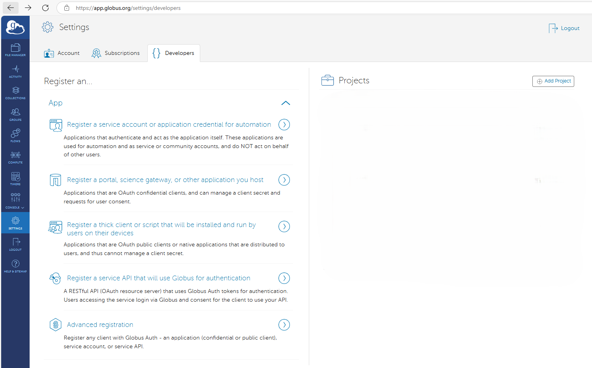

2. Select “Register a thick client or script that will be installed and run by users on their devices.”
3. Create or Select a Project
    - A project is a collection of apps with a shared list of administrators.
    - If you don’t own any projects, you will automatically be prompted to create one.
    - If you do, you will be prompted to either select an existing or create a new one.

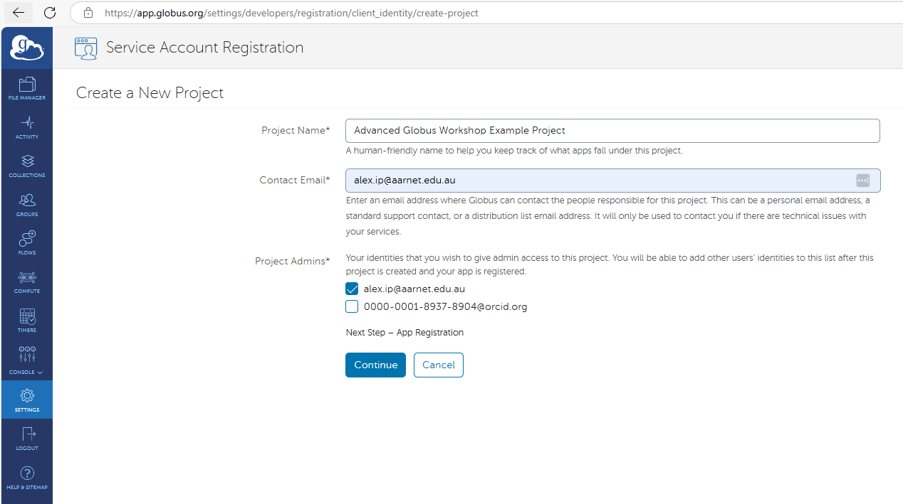

4. Creating or selecting a project will prompt you for another login, sign in with an account that administers your project.

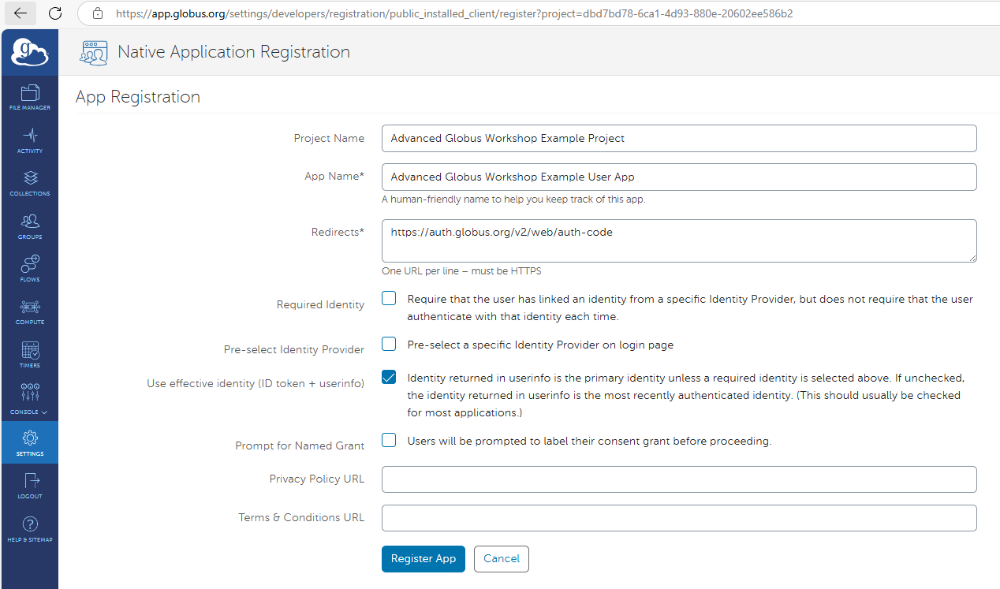

5. Give your App a name; this is what users will see when they are asked to authorize your app. We will use "Advanced Globus Workshop Example Project".
Enter your Globus account email address as the contact email.

6. Click “Register App”. This will create your app and take you to a page describing it.

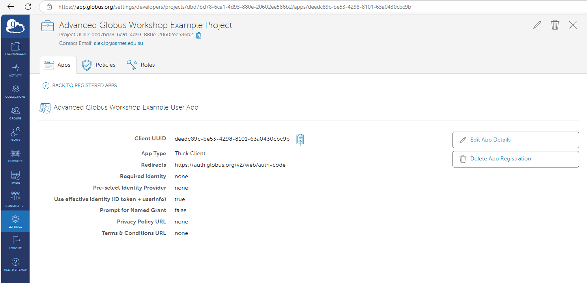

7. Copy the “Client UUID” from the page.
    - This ID is your App’s identifier. It is non-secure information and as such, feel free to hardcode it into scripts. You will need it for the examples below.

__Congratulations! You have just created a Globus User App you can use to access the API!__

### Registering and Running a Client App in Globus Auth (service user)
A client app is a script that you would create for a pre-defined service user to run. The service user would be authenticated using a client secret, and its
permissions would be determined by the policies applicable to that account, just like any "normal" user account. The service user ID is not sensitive, but the user
secret should be closely guarded in the same way that you would protect a normal account password. We used a pre-configured Client App for the Ansible example
earlier - the secret used for that will only be valid for this workshop.

### Registering a Client App
In order for a service user to run your script, we will first need to register a client app (service user). The procedure for doing this is as follows:

1. Navigate to the Globus [Developer Site](https://app.globus.org/settings/developers) - also accessible under "Settings" in the web app.


2. Select “Register a service account or application credential for automation.”
3. Create or Select a Project
    - A project is a collection of apps with a shared list of administrators.
    - If you don’t own any projects, you will automatically be prompted to create one.
    - If you do, you will be prompted to either select an existing or create a new one.


4. Creating or selecting a project will prompt you for another login, sign in with an account that administers your project.
5. Give your App a name; this is what users will see when they are asked to authorize your app.

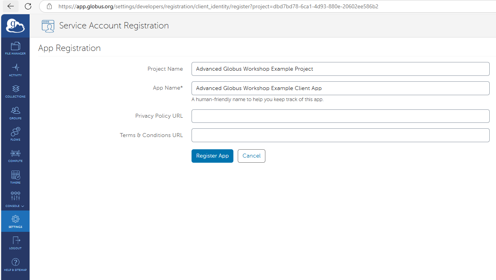

6. Click “Register App”. This will create your client app and take you to a page describing it.
7. Copy the “Client UUID” from the page.
    - This ID can be thought of as your Client App’s “username”. It is non-secure information and as such, feel free to hardcode it into scripts.

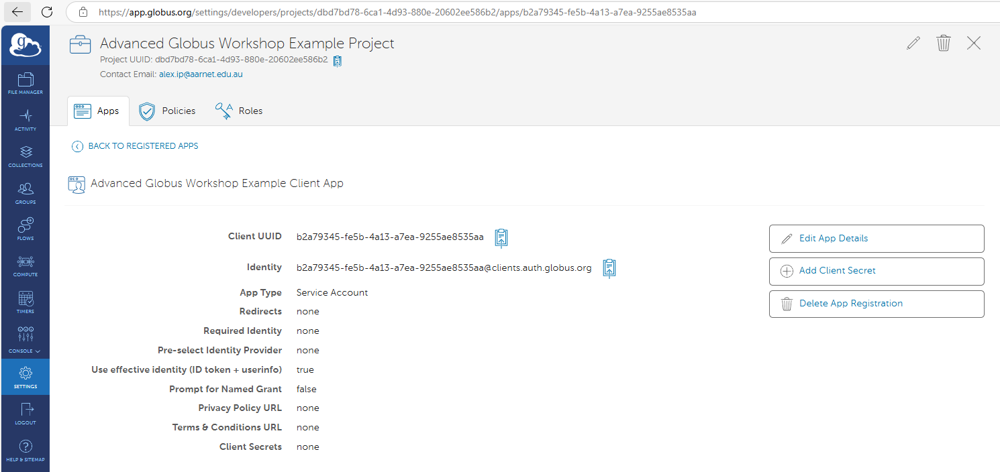

8. Click on "Add Client Secret" and enter the name of your Client App

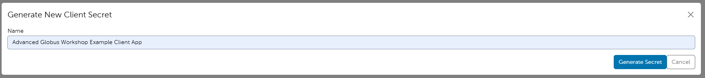

9. Click on "Generate Secret"


10. Copy the client secret and store it somewhere secure - you will only have this one opportunity to do so!

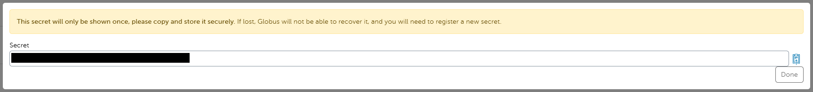

11. Add your service user to the list of users with write permissions on your writable guest collection

<!-- TODO: add pictures and instructions here -->

## Using the Globus SDK in Jupyter Notebooks
Globus maintains a full SDK (System Developers Kit) including a Python API, with documentation at https://globus-sdk-python.readthedocs.io/en/stable/.

This has already been installed for you on your workshop VM, along with some Jupyter notebooks.

The Globus Community Jupyter notebooks for the workshop should be pre-loaded on your VM. If you are going through these exercises in a different environment, then you may want to
download the notebooks from [here](https://github.com/AARNet/Globus-Community/tree/main/globus-community-australasia/workshops/jupyter_notebooks).

We will run the Jupyter notebook examples on the VM using port-forwarding from a browser on your laptop.

Firstly, you would start the Jupyter Notebook server (JupyterLab) on the VM as follows:

```bash
cd globus_community_notebooks
jupyter lab
```
This will launch JupyterLab and you should see something like the following (with a different token) at the end of the output:
```
    To access the server, open this file in a browser:
        file:///home/workshop-user/.local/share/jupyter/runtime/jpserver-108989-open.html
    Or copy and paste one of these URLs:
        http://localhost:8888/lab?token=be631b49d54575dc6741c91b8043cc83592cd71d261dabbe
        http://127.0.0.1:8888/lab?token=be631b49d54575dc6741c91b8043cc83592cd71d261dabbe
```

We will need to forward port 8888 from your laptop browser to the remote JupyterLab server on the VM. More details on SSH port forwarding can be found [here](https://www.ssh.com/academy/ssh/tunneling-example).

We will need to establish an ssh connection with local port 8888 forwarded through to port 8888 on the remote host. The SSH command would look something like this:
```bash
ssh -L 8888:localhost:8888 <your VM IP address>
```

<!-- TODO: write better port forwarding instructions - maybe in appendix -->

Once you have established the port forwarding, you should be able to copy and paste one of the last two URLs into your local browser, and you should see something like this:

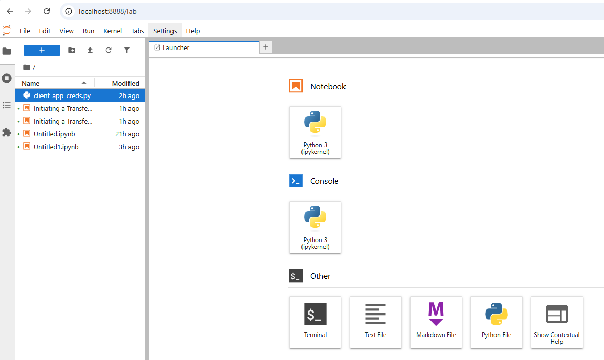

### Creating and populating guest collections with a User App in a Jupyter Notebook
We will use the Jupyter notebook `jupyter_notebooks/1. Create guest collections.ipynb` which uses several Globus SDK components to create guest collections in your brand-new mapped collection on your VM.
This script is not particularly pretty, but it gets the job done.

Open the notebook, and fill in values for the following constants. You can find the Globus hostname to put in `GLOBUS_HOSTS` by looking at the output of the
`globus-connect-server endpoint show` command you executed earlier. You need the hostname portion of the `GCS Manager URL` value;

- `NATIVE_CLIENT_ID` - This is the UUID of your Client App that you just created
- `GLOBUS_HOSTS` - This is the hostname given to your endpoint when you registered it
- `GLOBUS_USER_UUID` This is the UUID of your service user which is used to set the permissions on the guest collections. Make sure you use the ID of from the Client
App registration you did earlier. Note that your login user will be granted write access by virtue of owning the guest collections.

Restart the kernel and run the notebook using the double arrows at the top. You will need to authenticate twice using your browser: Once for the endpoint and once for the transfer operation. The script will report its progress at the bottom of the notebook.

When it has finished, you should have two new guest collections, with a set of test files in the RO collection. The RW collection will have permissions which allow 
your service user to write to it.


### Transferring files with a User App in a Jupyter Notebook
This section is optional, because you have already done a file transfer using a User App in the above example creating the guest collections.
We may skip this in the interests of time.

You should be able to open the Jupyter notebook `2. Initiating a Transfer with a UserApp.ipynb`

Edit the client ID and replace it with your user client ID that you copied from the registration. Edit the DST_COLLECTION value to be the UUID of the destination collection, noting that your personal Globus account must have write access to that collection.

Click on the double-arrow at the top of the notebook to restart the kernel and run all cells. You may be prompted to authenticate using a URL, and then pasting the
resultant token into an edit box.

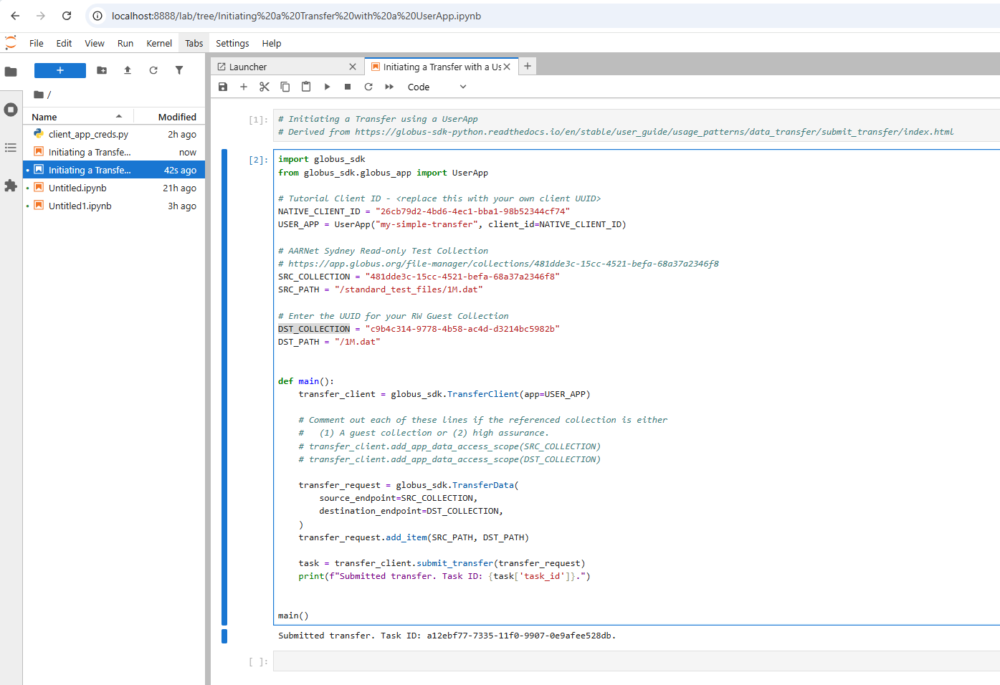

Check your destination collection, and, if all has gone well, the file should have been transferred there by the script.

**Congratulations! You should have initiated a transfer from one collection to another using your own user credentials!**

Of course, we may not want to have to go through the browser-based authenticate the first time we run a script, so we will now look at creating a service user and
running a client app.

### Transferring files with a Client App (service user) in a Jupyter Notebook
The Jupyter notebooks for the workshop should be pre-loaded on your VM. If you are going through these exercises in a different environment, then you may want to 
download the notebooks from [here](https://github.com/AARNet/Globus-Community/tree/main/globus-community-australasia/workshops/jupyter_notebooks).

As in the previous example, we will run the Jupyter notebook examples on the VM using port-forwarding from a browser on your laptop. Please follow the instructions above
to launch JupyterLab in your laptop browser.

You should now be able to open the Jupyter notebook `3. Initiating a Transfer with a ClientApp.ipynb`

Fill in the client ID and destination collection UUID

Click on the double-arrow at the top of the notebook to restart the kernel and run all cells.

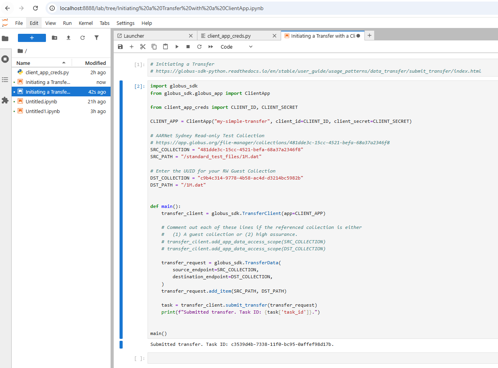

__Congratulations! You should have initiated a transfer from one collection to another using a service user!__
