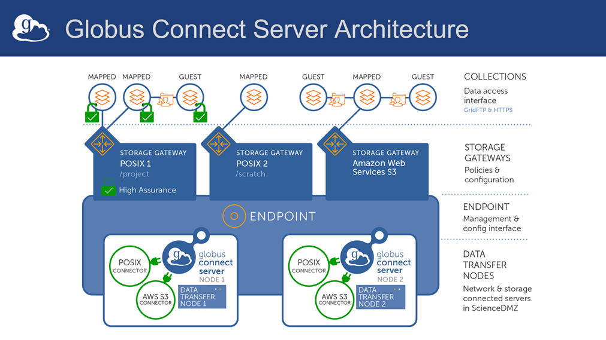

## AARNet eResearch Australasia 2025 Workshop - Advanced Globus

## Overview

In this half-day workshop, we will be exploring some advanced Globus configurations. At the conclusion of the workshop, you should be able to:

- Use connectors to interface Globus with storage systems other than Posix (e.g. S3)
- Implement automated workflows using Globus Flows to streamline your data processing and management tasks
- Use tools like Jupyter Notebooks with Globus
- Use Globus Compute to schedule jobs in HPC environments
- Set up custom user mappings for Globus authentication on local resources and optimise security settings

If time permits, we hope to have an round-table discussion of real-life Globus use-cases.

Note that there is a shared document for the workshop [here](http://tiny.cc/eRA25AdvGlobus). You will be able to add questions on notice if we don't have time to answer them interactively during the workshop.

## Workshop Prerequisites

You will need to bring the following to the workshop:

- A laptop with the ability to connect to an AWS EC2 instance via SSH in order to complete the hands-on sections of the workshop. Please ensure that your firewall permits outbound SSH access to arbitrary IP addresses. Power and WiFi will be provided.
- A valid educational or research institution account to gain access to Globus (must be available in [EduGain](https://edugain.org/) via the [Australian Access Federation (AAF)](https://aaf.edu.au/)) or [Tuakiri](https://www.reannz.co.nz/products-and-services/tuakiri/). A list of AAF institutions is available [here](https://aaf.edu.au/subscribers/), and Tuakiri [here](https://www.reannz.co.nz/membership/members/). Alternatively, you can also use ORCID, GitHub or Google to access Globus for the workshop.
- Sufficient familiarity with the Linux command line so that you are able to perform basic command line operations, edit text files, and install packages. If you are completely unfamiliar with Linux, you will still benefit from attending the workshop, but you may need assistance with the hands-on sections. Please let us know beforehand if you are likely to require this assistance.

Optionally, the following would be useful:

- The ability to install Globus Connect Personal (GCP) software on your laptop. You may wish to download this software from https://www.globus.org/globus-connect-personal and pre-install it before the workshop, or it can be downloaded and installed in the workshop. Note that if you are unable to install GCP due to restrictions on your laptop, you will only be able to observe demonstrations of its use.

To get the most out of this workshop, you should already be able to:

- Know what Globus is and the benefits it provides for researchers
- Use the Globus web interface to transfer files between collections
- Understand the high-level architecture of Globus
- Install Globus Connect Personal software and set up a local endpoint with collections
- Install Globus Connect software on a Linux host and set up an endpoint with collections
- Configure Globus Storage Gateways and Collections for fine-grained access control
- Know how to monitor user activity on your collections

These skills were covered in the half-day ["Introduction to Globus" workshop](../introduction_to_globus_workshop/) run by AARNet at eResearch Australasia in 2024, and also in the morning session before this afternoon workshop.

Please contact alex.ip@aarnet.edu.au, steele.cooke@aarnet.edu.au or chris.myers@aarnet.edu.au if you are unsure about any of the above requirements.

## Agenda
### PART I
#### PRELUDE (15-20 minutes) - Sara
##### Housekeeping - fire exits, break times + laptop checks
##### Acknowledgement of Country
##### Introductions - instructors, helpers + how to participate
##### Plan for the day - aims, learning objectives, timing (2 x 90min sessions + 30 min break)

### ADVANCED GLOBUS (90mins) - Alex, Chris and Steele
##### Quick Review of Globus System Architecture

##### Using the Globus API tools with including Jupyter Notebooks

##### Implementing automated workflows using Globus Flows to streamline your data processing and management tasks

##### Using Globus Compute to schedule jobs in HPC environments

##### Using connectors to interface Globus with storage systems other than Posix (e.g. S3)

##### Setting up custom user mappings for Globus authentication on local resources and optimise security settings

##### Open Discussion (15-20 minutes)
- Introduce Globus Community Australasia
- Specific use Cases

## Quick Review of Globus System Architecture
Below is a high-level diagram of the major components of the Globus system.



### Definitions
#### Endpoint
A logical construct that identifies an instance of Globus Connect to the Globus service. Each endpoint is registered with Globus and receives a new DNS record. An endpoint aggregates one or more Data Transfer Nodes.

#### Data Transfer Node (DTN)
A physical manifestation of the endpoint. More DTNs for an endpoint mean a larger physical footprint and better resilience and performance. Each DTN has a unique IP address which is registered with the Globus and the DNS record for the endpoint.

#### Connector
A software package that implements an interface allowing the Globus service to access a specific storage system (e.g. POSIX, S3, etc). Note that users will never interact directly with a connector. Note also that POSIX is supported by default, and additional connectors may entail an extra cost.

#### Storage Gateway
An instance of a Globus Connector configured to access a storage system using specified policies (valid IDPs, path restrictions, etc.).

#### Collection
A logical construct that allows a user to access data via the Globus service (constrained by the underlying Storage Gateway). One could think of this as a "projection" of part or all of a storage system via the Globus service.

#### UUID
A Universally Unique Identifier (UUID) is a 128-bit label used for information in computer systems. The term Globally Unique Identifier (GUID) is also used, mostly in Microsoft systems. Every Globus entity is assigned a UUID, which looks like the following:
```
a3f0c02a-866a-472e-8f13-248360e296f7
```
These UUIDs are used by Globus to uniquely identify resources, so they are particularly important in the context of automation. They can also be used to search for endpoints or collections in the Web UI.

## Using tools like Jupyter Notebooks with the Globus API
Globus maintains a full SDK (System Developers Kit) including a Python API, with documentation at https://globus-sdk-python.readthedocs.io/en/stable/.

This has already been installed for you on your workshop VM

### Authentication

#### Definitions
To use the API, we will need to authenticate with Globus. Details about this process can be found in the Globus documentation on [Clients, Scopes, and Consents](https://docs.globus.org/guides/overviews/clients-scopes-and-consents/).

The important points to note are 
- A __Client__ is an application like the CLI or Web Application.
    - Users can register their own Clients.
- __Scopes__ define actions which are permitted within Globus.
- __Tokens__ are credentials used by Clients to represent a user. They are always issued with some associated Scopes.
- __Consents__ are records of a user granting a Client permissions in the form of a set of Scopes.
    - Tokens will be issued to the Client, associated with the requested Scopes.

#### Application Types
There are two types of applications which can be authorised in Globus: UserApps and ClientApps.

- UserApp, for interactions in which a "real" end user communicates with Globus services
- ClientApp, for interactions in which an OAuth2 client, operating as a “service account”, communicates with Globus services.

Details about these application types can be found at https://globus-sdk-python.readthedocs.io/en/stable/authorization/globus_app/apps.html

The following table provides a comparison of these two options:

| UserApp | ClientApp |
| :--- | :--- |
| Appropriate for performing actions as a specific end user (e.g., the Globus CLI) | Appropriate for automating actions as a service account |
| Created resources (e.g., collections or flows) by default are owned by an end user | Created resources (e.g., collections or flows) by default are owned by the OAuth2 client |
| Existing resource access is evaluated based on an end user’s permissions | Existing resource access is evaluated based on the OAuth2 client’s permissions |
| OAuth2 tokens are obtained by putting an end user through a login flow (this occurs in a web browser) | OAuth2 tokens are obtained by programmatically exchanging an OAuth2 client’s secret |
| Should typically use a “native” OAuth2 client (Register a thick client) | May use a “confidential” OAuth2 client (Register a portal or science gateway) |
| Must use a “confidential” OAuth2 client | (Register a service account) |

#### Registering a User App in Globus Auth (taken from https://globus-sdk-python.readthedocs.io/en/stable/user_guide/getting_started/register_app.html)
In order for a "real" user to run your script, we will need to register a user app with appropriate scopes. The procedure for doing this is as follows:

1. Navigate to the Globus [Developer Site](https://app.globus.org/settings/developers) - also accessible under "Settings" in the web app.


2. Select “Register a thick client or script that will be installed and run by users on their devices.”
3. Create or Select a Project
    - A project is a collection of apps with a shared list of administrators.
    - If you don’t own any projects, you will automatically be prompted to create one.
    - If you do, you will be prompted to either select an existing or create a new one.
4. Creating or selecting a project will prompt you for another login, sign in with an account that administers your project.


5. Give your App a name; this is what users will see when they are asked to authorize your app.
6. Click “Register App”. This will create your app and take you to a page describing it.
7. Copy the “Client UUID” from the page.
    - This ID can be thought of as your App’s “username”. It is non-secure information and as such, feel free to hardcode it into scripts.

#### Registering a Client App in Globus Auth (service user)
In order for a service user to run your script, we will need to register a client app with appropriate scopes. The procedure for doing this is as follows:

1. Navigate to the Globus [Developer Site](https://app.globus.org/settings/developers) - also accessible under "Settings" in the web app.


2. Select “Register a service account or application credential for automation.”
3. Create or Select a Project
    - A project is a collection of apps with a shared list of administrators.
    - If you don’t own any projects, you will automatically be prompted to create one.
    - If you do, you will be prompted to either select an existing or create a new one.


4. Creating or selecting a project will prompt you for another login, sign in with an account that administers your project.
5. Give your App a name; this is what users will see when they are asked to authorize your app.


6. Click “Register App”. This will create your client app and take you to a page describing it.
7. Copy the “Client UUID” from the page.
    - This ID can be thought of as your Client App’s “username”. It is non-secure information and as such, feel free to hardcode it into scripts.


8. Click on "Add Client Secret" and enter the name of your Client App


9. Click on "Generate Secret"


10. Copy the client secret and store it somewhere secure - you will only have this one opportunity to do so!


