## Overview

In this half-day workshop, we will be working through the process of setting up and configuring a Globus endpoint and collections. At the conclusion of the workshop, you should be able to:

- Know what Globus is and the benefits it provides for researchers
- Use the Globus web interface to transfer files between collections
- Understand the high-level architecture of Globus
- Install Globus Connect Personal software and set up a local endpoint with collections
- Install Globus Connect software on a Linux host and set up an endpoint with collections
- Configure Globus Storage Gateways and Collections for fine-grained access control
- Know how to monitor user activity on your collections

If time permits, we may be able to cover some additional advanced topics.

Note that there is a shared document for the workshop [https://tinyurl.com/eRA25-Globus](https://tinyurl.com/eRA25-Globus). 

Please enter your name against an IP address for the session you are in - that will be your virtual machine for the session.

You will be able to add questions on notice to the document if we don't have time to answer them interactively during the workshop.

## Workshop Prerequisites

You will need to bring the following to the workshop:

- A laptop with the ability to connect to an AWS EC2 instance via SSH in order to complete the hands-on sections of the workshop. Please ensure that your firewall permits outbound SSH access to arbitrary IP addresses. Power and WiFi will be provided.
- A valid educational or research institution account to gain access to Globus (must be available in [EduGain](https://edugain.org/) via the [Australian Access Federation (AAF)](https://aaf.edu.au/)) or [Tuakiri](https://www.reannz.co.nz/products-and-services/tuakiri/). A list of AAF institutions is available [here](https://aaf.edu.au/subscribers/), and Tuakiri [here](https://www.reannz.co.nz/membership/members/). Alternatively, you can also use ORCID, GitHub or Google to access Globus for the workshop.
- Sufficient familiarity with the Linux command line so that you are able to perform basic command line operations, edit text files, and install packages. If you are completely unfamiliar with Linux, you will still benefit from attending the workshop, but you may need assistance with the hands-on sections. Please let us know beforehand if you are likely to require this assistance.

Optionally, the following would be useful:

- The ability to install Globus Connect Personal (GCP) software on your laptop. You may wish to download this software from https://www.globus.org/globus-connect-personal and pre-install it before the workshop, or it can be downloaded and installed in the workshop. Note that if you are unable to install GCP due to restrictions on your laptop, you will only be able to observe demonstrations of its use.

Please contact alex.ip@aarnet.edu.au, steele.cooke@aarnet.edu.au or chris.myers@aarnet.edu.au if you are unsure about any of the above requirements.

## Agenda
### PART I
#### PRELUDE (15-20 minutes) - Sara
##### Housekeeping - fire exits, break times + laptop checks
##### Acknowledgement of Country
##### Introductions - instructors, helpers + how to participate
##### Ice breaker + Mentimeter
##### Plan for the day - aims, learning objectives, timing (2 x 90min sessions + 30 min break)

#### WHAT IS GLOBUS? (15-20 minutes) - Greg
##### What is Globus?
##### Installing Globus Connect Personal (optional)
##### Using Globus for simple file transfers (Demo and Hands-on)
##### Globus Architecture and Concepts

#### LOGGING IN TO WORKSHOP VM AND INSTALLING GLOBUS PACKAGES (15-20 minutes) - Alex and Chris
- Logging into Globus
- Logging into workshop virtual machine

### BREAK

### PART II
### INSTALLING AND CONFIGURING GLOBUS (90mins) - Alex, Chris and Steele
##### Installing Globus (Hands-on) (45 minutes?)
- Installing Globus Packages
- Creating an Endpoint
- Creating a Data Transfer Node
- Creating a Storage Gateway
- Creating a Mapped Collection
- Adding an Endpoint to a Subscription
- Creating a Guest Collection

##### Configuring Globus (Hands-on) (15-20 minutes)
- File and Directory Permissions
- Storage Gateway Permissions
- Globus Credentials
- Transfer and Timing Options
- Decommissioning

##### Open Discussion (15-20 minutes)
- Launch Globus Community AU
- Specific use Cases
- Bonus Advanced Topics (e.g. Globus Flow, Automation)

## INTRODUCTORY MATERIAL
### What is Globus?
At its most basic, Globus lets you share data on your storage systems with collaborators at other institutions. You specify what data. You specify which colleagues. Globus manages access simply and securely, so you can focus on your research.

A researcher will interact with Globus Collections. Collections are files on local storage published through globus. Permissions are managed by the collection owners.

Globus offers the following advantages:
- Ease of Use: Globus uses a simple and intuitive web interface for initiating or scheduling transfers. Periodic directory synchronisation jobs can be scheduled through the UI, and users will be notified of transfer outcomes via email.
- Performance: Globus will utilise concurrency and parallel transfers to optimise the use of the available bandwidth between collections.
- Reliability: Globus will continue transfers after any interruption to the network with no user intervention. It is a "set and forget" service.
- Interoperability: Globus is a mature and popular system being used by organisations worldwide to transfer over 1.8PB/day between more than 62,000 active endpoints.
- Data Integrity:	Globus uses checksums during transfers and on entire files to ensure that there is no data corruption.
- Security: Collection and file access can be locked down to specific users or groups. Globus works with local file stores controlled by the users, and no data is ever replicated to third party storage. Data can be encrypted for additional security en-route.
- Flexibility: Globus offers a command line interface and API to facilitate scripting and automation. There is also Globus Flow for distributed workflow orchestration.
- Accessibility:	Globus provides a way of publishing files for anonymous download via HTTPS for anyone without requiring them to have Globus software or a Globus account (subject to permissions)
- Cost-effectiveness: Globus offers an "all-you-can-eat" subscription model to educational and research institutions through AARNet. Under that subscription, you can set up as many endpoints and collections as you need, and transfer as much data as you like.

### Mapped Collections
Mapped Collections are collections where Globus logins are explicitly mapped to local user accounts.

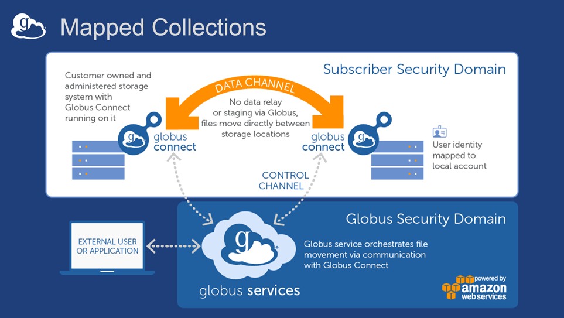

### Guest Collections

Guest Collections are collections where user-specified Globus logins are overlaid on the collection owner's local account.

**Note that guest collections are a subscription-only option**

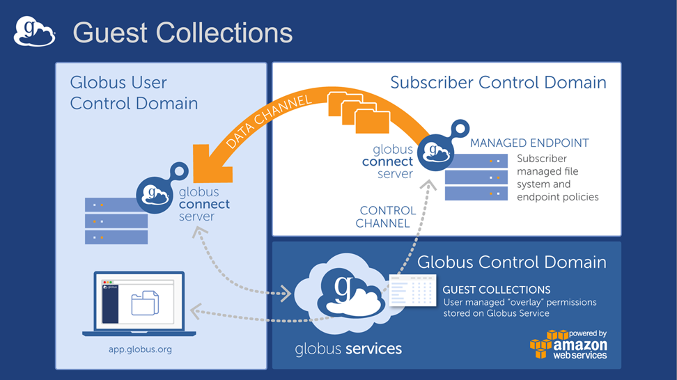

### Globus Architecture and Concepts

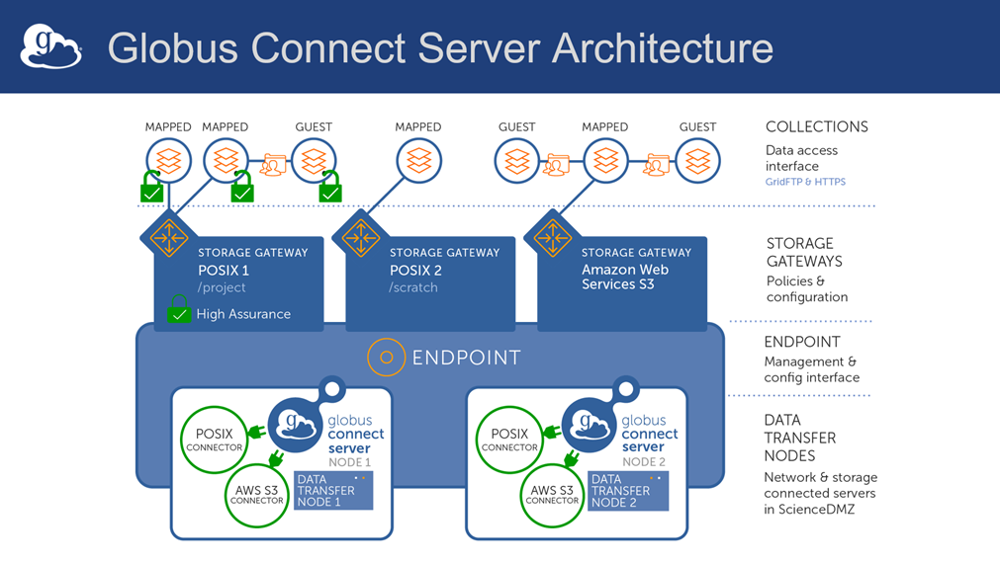

#### Definitions
##### Endpoint
A logical construct that identifies an instance of Globus Connect to the Globus service. Each endpoint is registered with Globus and receives a new DNS record. An endpoint aggregates one or more Data Transfer Nodes.

##### Data Transfer Node (DTN)
A physical manifestation of the endpoint. More DTNs for an endpoint mean a larger physical footprint and better resilience and performance. Each DTN has a unique IP address which is registered with the Globus and the DNS record for the endpoint.

##### Connector
A software package that implements an interface allowing the Globus service to access a specific storage system (e.g. POSIX, S3, etc). Note that users will never interact directly with a connector. Note also that POSIX is supported by default, and additional connectors may entail an extra cost.

##### Storage Gateway
An instance of a Globus Connector configured to access a storage system using specified policies (valid IDPs, path restrictions, etc.).

##### Collection
A logical construct that allows a user to access data via the Globus service (constrained by the underlying Storage Gateway). One could think of this as a "projection" of part or all of a storage system via the Globus service.

##### UUID
A Universally Unique Identifier (UUID) is a 128-bit label used for information in computer systems. The term Globally Unique Identifier (GUID) is also used, mostly in Microsoft systems. Every Globus entity is assigned a UUID, which looks like the following:
```
a3f0c02a-866a-472e-8f13-248360e296f7
```
These UUIDs are used by Globus to uniquely identify resources, so they are particularly important in the context of automation. They can also be used to search for endpoints or collections in the Web UI.

### HANDS-ON EXERCISES
These are the instructions for the hands-on exercises for the Globus workshop.

#### USING GLOBUS CONNECT PERSONAL TO TRANSFER FILES TO YOUR LAPTOP (OPTIONAL)
**NOTE: In order to install Globus Connect Personal (GCP) on your laptop, you will need to have the appropriate administrative privileges on your machine. If you are unable to install GCP software on your machine, then you will not be able to proceed with this particular hands-on exercise and will have to watch the workshop demonstration instead.**

##### INSTALLING GLOBUS CONNECT PERSONAL (GCP)
Use your web browser to navigate to https://www.globus.org/globus-connect-personal. Choose the download for your operating system (i.e. MacOS, Windows or Linux). Follow the instructions there to download, install and configure GCP.

**Note: Make sure you remember the name or UUID you use for your local collection. You will need it to select the collection later.**

##### USING GLOBUS FOR SIMPLE FILE TRANSFERS
In this exercise, you will use the Globus web application to transfer files between two collections. In order to do this, you will need to have write access to the destination collection, so we will use the writable collection on your laptop accessible through the previously installed Globus Connect Personal software.

To proceed, you must have a working installation of Globus Connect Personal with a writable collection configured. Make sure your GCP instance is running.

Open a web browser and navigate to https://globus.org.

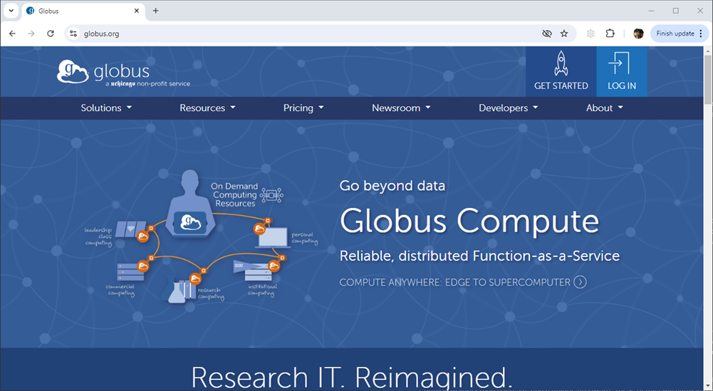

Click on the "LOG IN" button on the top right. You will be redirected to the CILogon login page, where you will either need to select your institution in the drop-down box and click "Continue", or select one of the three alternative identity providers, i.e. GitHub, Google or ORCID.

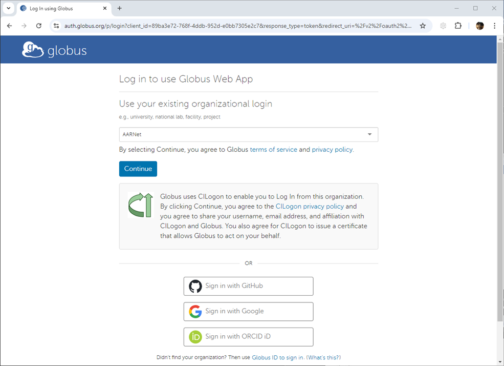

You will be redirected to your nominated identity provider for authentication. Log in using your credentials. For example, the AARNet login screen appears as follows, but your institutional login screen will be different:

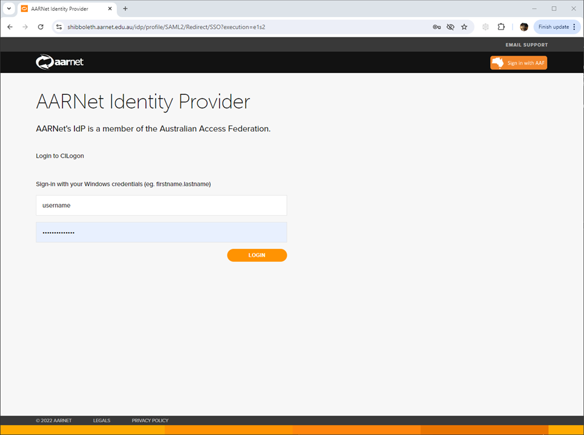

Once you have logged in, you will be redirected to the Globus web app page.

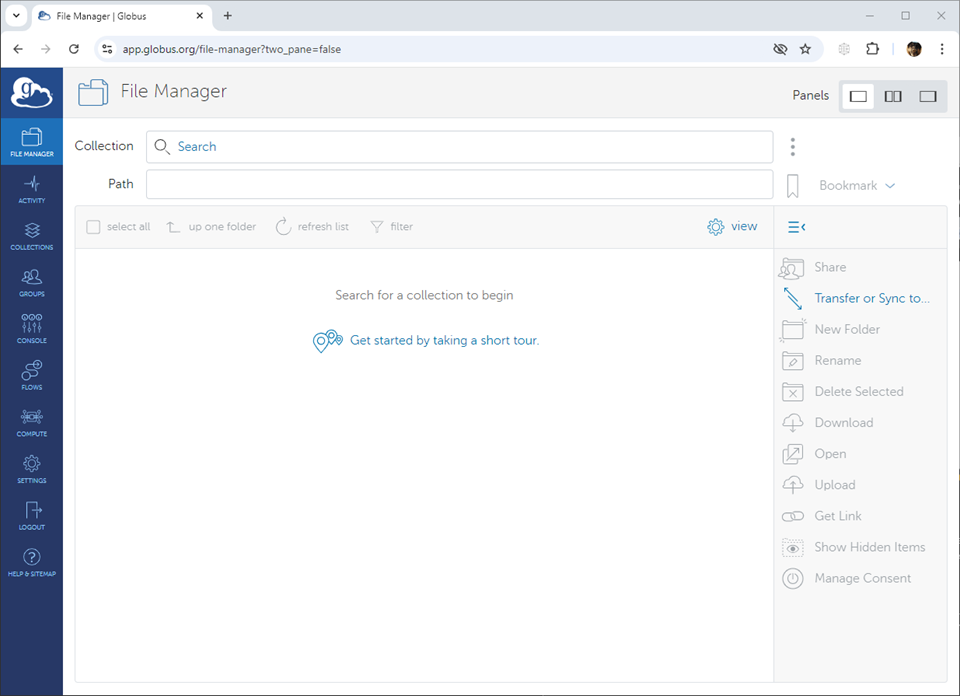

You are now ready to transfer files using Globus. To do so, we will need to show the intended source and destination collections in two-pane mode. Click on the "set two pane" button on the top right of the window as follows:

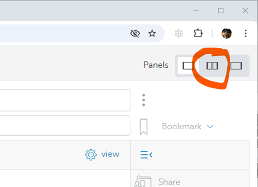

You should now be in two-pane viewing mode. We will now set the source collection in the left-hand pane, noting that the actual side really doesn't matter. Click on the left-hand Collection Search bar on the top left of the window.

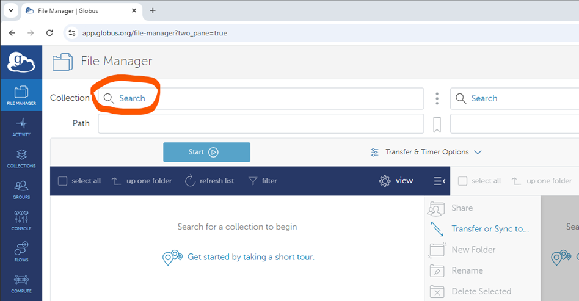

Enter "AARNet" into the search box as follows. You will see up to nine AARNet collections.

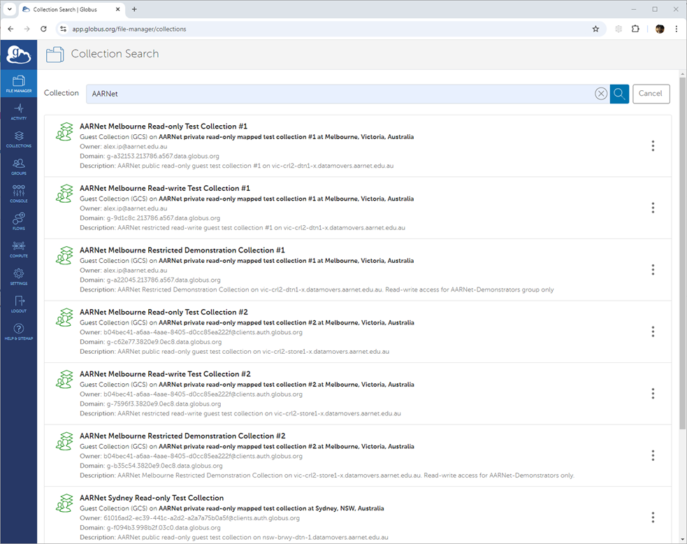

###### Globus test collections
You will need to select one of the read-only collections below as a source collection. Note that these test servers are experimental and are provided by AARNet on a best-effort basis only:

- [AARNet Globus Endpoint NSW (ARTM) POSIX Gateway Public RO Guest Collection](https://app.globus.org/file-manager?origin_id=9e472d3a-ac18-42d0-bac8-3c9220801fbe&origin_path=%2Fstandard_test_files%2F&two_pane=true)
- [AARNet Globus Endpoint NSW (ETCA) POSIX Gateway Public RO Guest Collection](https://app.globus.org/file-manager?origin_id=ba7a1bc4-dacd-47a7-bc92-87d0a5768305&origin_path=%2Fstandard_test_files%2F&two_pane=true)
- [AARNet Globus Endpoint NSW (MCQM) POSIX Gateway Public RO Guest Collection](https://app.globus.org/file-manager?origin_id=12b88024-167c-4869-ab40-69bbf07ce3c5&origin_path=%2Fstandard_test_files%2F&two_pane=true)

If you open an AARNet test collection, you can double-click on the "standard_test_files" directory in the left-hand collection pane. This is a copy of various sizes and numbers of test files, originally from the ESnet CERN collection. **Tip: Clicking on any of the three hyperlinks above will take you directly to the "standard_test_files" directory in the required collection.**

There are a number of other public, read-only test collections published by various organisations you can use for testing, including:
- [ESnet CERN DTN (Anonymous read-only testing)](https://app.globus.org/file-manager?destination_id=531643be-e83e-4ebc-a0d1-d459b48432e7&destination_path=%2Ftest3%2F&origin_id=722751ce-1264-43b8-9160-a9272f746d78&two_pane=true)

Globus also provides writable test collections, each with a 10MB quota to prevent abuse.
- [Globus Tutorial Collection 1](http://app.globus.org/file-manager?origin_id=6c54cade-bde5-45c1-bdea-f4bd71dba2cc&two_pane=true)
- [Globus Tutorial Collection 2](http://app.globus.org/file-manager?origin_id=31ce9ba0-176d-45a5-add3-f37d233ba47d&two_pane=true)

Now you will need to select the destination collection, which will be the local collection made visible via your GCP instance running on your laptop. Click on the right-hand Collection Search bar as follows:

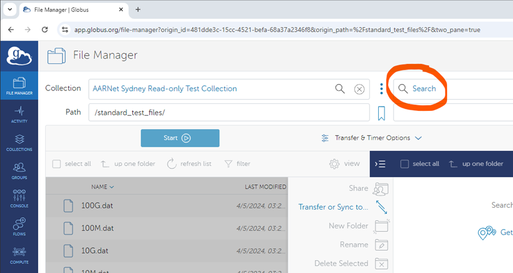

Enter all or part of the name for your local collection in the search box, or the UUID for your collection if you know it. Click on your collection.

You should now have your source and destination collections visible, one in each pane of the Globus file manager window.

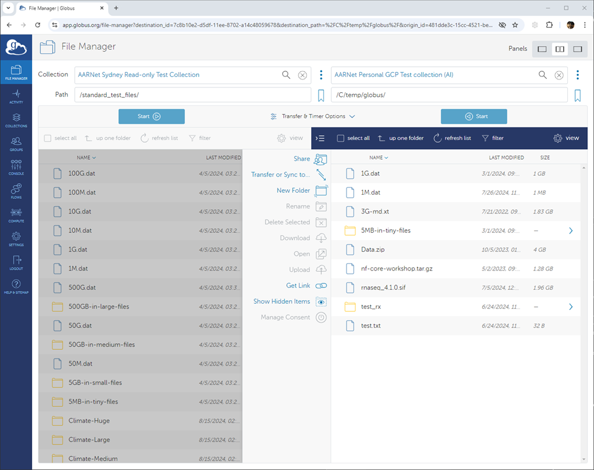

To transfer a file from the source collection on the left to the destination collection on the right, simply drag and drop the file. Note: Since the transfer will go from the source collection to your laptop, it is strongly suggested that you choose files 100MB or smaller, i.e. 100M.dat, 10M.dat or 1M.dat for this exercise so that we don't overwhelm the workshop WiFi. The AARNet and ESnet collections are persistent, so you will be able to test the transfer of larger files and entire directories later outside the workshop.

Once you have successfully initiated the transfer, you will see a popup in the top right corner of your window as follows:

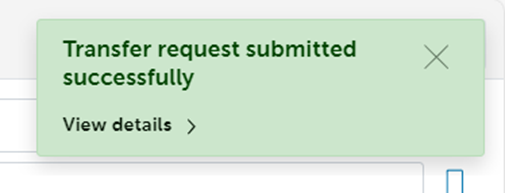

This will mean that Globus has scheduled the transfer and will coordinate the two endpoints involved. The transfer is "set and forget" and will automatically resume after any network failure. You will receive an email notification to your Globus account email address when it is complete.

Click on the "View details" link to see the transfer status. You will need to do this quickly if you're only transferring a small file and want to see the transfer in progress, otherwise it will have completed before you view the status page, which will look something like this:

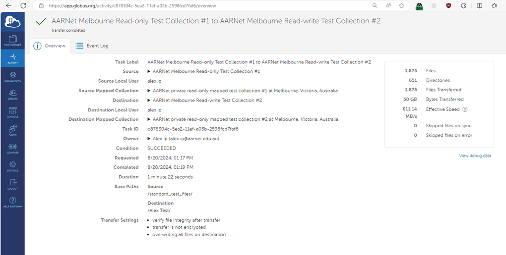

#### HTTPS FILE TRANSFERS TO/FROM GLOBUS (Subscription-only Feature)
Some users may wish to upload or download files via HTTPS rather than transferring files from collection to collection via Globus. HTTPS downloads have been enabled on all of the AARNet  read-only and read-write collections for all users, so these files are all downloadable by anyone using HTTPS, i.e. without needing to have GCP installed. Note that HTTPS downloads will not have the same "set-and-forget" facility: the upload/download will fail if there is an interruption to the network connection.

You can upload to a collection using HTTPS only if the endpoint is associated with a subscription and you have been given write access to all or part of the collection. You will be able to test the HTTPS upload feature with your own collection later in the workshop.

Note that the AARNet read-only and read-write Globus test collections are associated with the AARNet subscription and have all been set up to be anonymously readable, so it is perfectly feasible to provide a persistent URL for anonymous HTTPS download of a given file or directory from any of these collections. You will be able to do the same on your own collections if your endpoint is associated with a subscription.

You can download a file either by highlighting the file or directory you wish to download and clicking on the "Download" button in the middle of the file manager, or by right-clicking on the file or directory and selecting "Download".

You can also obtain a persistent link for anonymous download either by highlighting the file or directory you wish to download and clicking on the "Get Link" button in the middle of the file manager, or by right-clicking on the file or directory and selecting "Get Link" as follows:

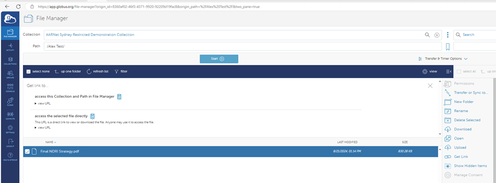

## SETTING UP A GLOBUS CONNECT ENDPOINT ON A LINUX HOST
This hands-on exercise will involve setting up and configuring a Globus endpoint on a Linux host. We have provided a virtual machine (VM) for each workshop participant on which you will be able to install Globus Connect Server v5 (GCSv5). Note that these workshop VMs will be destroyed after the workshop, and they are not intended for high-volume transfers or transfer performance evaluation.

A comprehensive video has been published by Globus on YouTube at [Introduction to Globus for System Administrators - YouTube](https://www.youtube.com/watch?v=86uEdOOfY7g&t=2272s). There is full documentation available at [Globus Connect Server](https://docs.globus.org/globus-connect-server/).

Note: Before you start, you will need to make sure that you have a valid institutional account you can use to log into the [Globus Web App](https://app.globus.org/), or, alternatively, a GitHub, Google or ORCID account. This user will become the owner of the Globus objects you will create in this part of the workshop.

We have already taken care of the networking prerequisites on the virtual machines in this workshop, so you will not need to configure the firewall or port forwarding rules.

Some tips for the hands-on sections below:
- The text shown in Courier (fixed-pitch) font is either command templates or output. Custom values in commands are shown enclosed in angle-brackets like this: ```<custom text to be replaced>```.
- You will often need to change contents of the commands to your custom values (e.g. usernames or IP addresses), so we recommend copying and pasting the commands into a local editor (e.g. notepad++), making the required changes, and then copying and pasting the modified text into the SSH window. Don't try copying and pasting the original commands into the SSH window as-is.
- You may need to use a right mouse click to copy or paste into your SSH window (e.g. for your login password). Ask one of the workshop helpers if you can't get it to work
- The SSH window to Linux is __not__ like an edit box - you will need to use the arrow keys to move backwards and forwards in a command instead of a mouse click when editing.
- At the Linux command line, the up and down arrow keys will scroll through previously entered commands. This can save you some typing.

### LOGGING INTO WORKSHOP VIRTUAL MACHINE (VM)
On the day of the workshop, you will be provided with an IP address for your own VM, a standard username, and a unique password. These details will allow you to connect to your virtual machine which will exist for the duration of the workshop. Please do not share your credentials with others.

You can use any SSH client to connect to your VM, so feel free to use anything you are already familiar with (e.g. PuTTY, MobaXterm, etc). If you haven't used SSH before, then basic instructions for Windows and MacOS are below.

#### Microsoft Windows
SSH should be available from the Windows command line.

Type "cmd" into the search box in the taskbar, and then click on the "Command Prompt" icon on the top right. You will see a window with a command prompt.

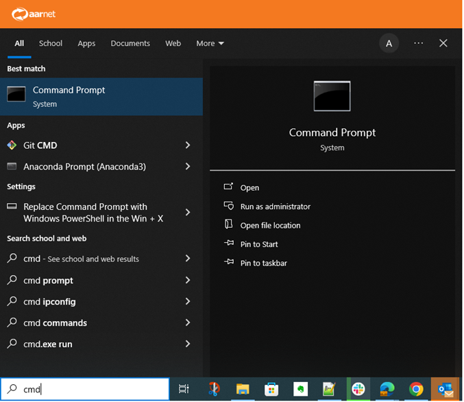

Type in the following at the command prompt, substituting your username and IP address.
```
ssh <username>@<ip_address>
```
Skip to the "All Operating Systems" section below to continue

#### MacOS
SSH should be available from the MacOS terminal.

Open Spotlight by pressing "Command" and "Space" at the same time, and then type "Terminal". Either click the terminal icon or press "Enter" to open a new terminal window.

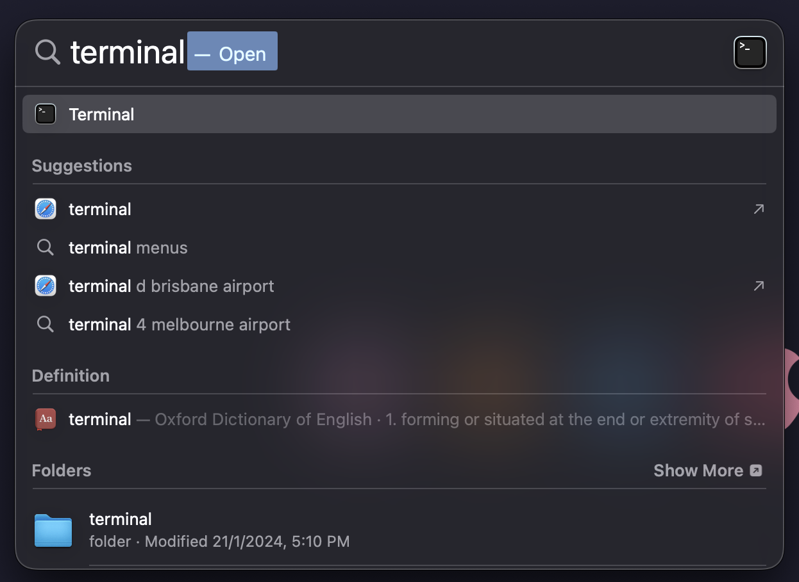

Type in the following in your terminal window, substituting your username and IP address.
```
ssh <username>@<ip_address>
```
Note: You can also paste commands shown later in the workshop into your terminal by pressing "Command" and "V".

Skip to the "All Operating Systems" section below to continue

#### All Operating Systems
You will see something like the following prompt the first time you log in. Enter "yes" to continue.

```
The authenticity of host '<ip_address> (<ip_address>)' can't be established.
ECDSA key fingerprint is SHA256:8sCp8BKZF9XTyOUDUz+v68ik6Hh+lyziUG6iZQcZsQV.
Are you sure you want to continue connecting (yes/no/[fingerprint])?
```
You will then be prompted for your password for the VM. This should log you into the VM so you will see a command prompt. Please ask the workshop helpers for assistance if you have trouble getting to this point.

### INSTALLING GLOBUS PACKAGES

#### PREREQUISITES (Already met by workshop VMs)
The virtual machines you will be using for this workshop are preconfigured to meet the requirements for a Globus Connect Server v5 (GCSv5) installation. If you wish to set up GCSv5 on your own host, you will need to meet the following prerequisites:

- The following Linux distributions are supported:
    - CentOS 7, 8 Stream, 9 Stream
    - Rocky Linux 8, 9
    - AlmaLinux 8, 9
    - Springdale Linux 8, 9
    - Oracle Linux 8, 9
    - Debian 11, Debian 12
    - Fedora 39, 40
    - Red Hat Enterprise Linux 7, 8, 9
    - Ubuntu 20.04 LTS, 22.04 LTS, 23.10, 24.04 LTS
    - SUSE Linux Enterprise Server 15.4, 15.5
    - OpenSUSE Leap 15.4, 15.5

- The minimum memory requirement is only 2GB of RAM. Note that while GCS can run in an environment with these minimum specifications, this is not a suggested configuration for a production environment and should not be used to evaluate performance.

- You must have administrator (root) privileges on your system; sudo can be used to perform the installation.

- Your system must be running ntpd or another daemon for synchronizing with standard time servers.

- Your system must use a unicode-capable locale in order to run the Globus Connect Server command-line tools. For RedHat, CentOS, and Fedora systems, you can use the en_US.UTF-8 locale, and for Debian and Ubuntu systems, you can use the C.UTF-8 locale.

- Other hosts on the Internet must be able to initiate connections to the system via open TCP ports 443 and 50000-51000. Note that hosts using NAT behind a firewall will require special treatment - this is required for the VMs in this workshop but it has already been set up for you.

Please contact AARNet if you require any assistance with configuring your own machine after this workshop.

#### RedHat or CentOS Installation
You can use either yum or dnf to install GCSv5 on a Redhat variant of Linux.

##### Using yum for RedHat/CentOS:
__NOTE: PLEASE USE THIS YUM INSTALLATION METHOD FOR THE WORKSHOP__
```
# Setup repo for Globus
sudo yum -y install https://dl.fedoraproject.org/pub/epel/epel-release-latest-9.noarch.rpm
sudo /usr/bin/crb enable
sudo yum -y install https://downloads.globus.org/globus-connect-server/stable/installers/repo/rpm/globus-repo-latest.noarch.rpm

# Install Globus Connect Server
sudo yum -y install globus-connect-server54
```
__NOTE: PLEASE DO NOT USE THE INSTALLATION METHODS BELOW FOR THE WORKSHOP - THEY ARE INCLUDED FOR INFORMATION ONLY__

##### Using dnf for RedHat/CentOS (DO NOT USE FOR WORKSHOP):
```
# Setup repo for Globus
sudo dnf install https://dl.fedoraproject.org/pub/epel/epel-release-latest-9.noarch.rpm
sudo /usr/bin/crb enable
sudo dnf install https://downloads.globus.org/globus-connect-server/stable/installers/repo/rpm/globus-repo-latest.noarch.rpm

# Install the DNF config manager:
sudo dnf install 'dnf-command(config-manager)'

# Install Globus Connect Server:
sudo dnf install globus-connect-server54
```
#### Ubuntu or Debian (DO NOT USE FOR WORKSHOP)
```
curl -LOs https://downloads.globus.org/globus-connect-server/stable/installers/repo/deb/globus-repo_latest_all.deb
sudo dpkg -i globus-repo_latest_all.deb
sudo apt-key add /usr/share/globus-repo/RPM-GPG-KEY-Globus
sudo apt update
sudo apt install globus-connect-server54
```
### CREATING AN ENDPOINT
Once the GCSv5 packages are installed, we can create a Globus endpoint using the ```globus-connect-server``` command line utility. Note that the local user you are logged into the VM as will become the local owner of the Globus installation.

A Globus Endpoint is a logical construct that identifies an instance of Globus Connect to the Globus service. An endpoint can have one or more Data Transfer Nodes.

Use the following command, substituting your values as required. The "owner" value should be your institutional email address that you will use for Globus. **Note that the option ```--use-explicit-host <your public IP>``` is required for the NATed network setup of the VM in this workshop. You will not need this option if you have a public IP address on your server**

As with many of the code snippets in this workshop, it is recommended that you copy and paste it into a text editor and replace the items in angled brackets with correct values for you.
```
globus-connect-server --use-explicit-host <your public IP> \
    endpoint setup \
    --organization "<your organization>" \
    --contact-email <your Globus account email address>\
    --owner <your Globus account email address> \
    "<your descriptive endpoint name>"
```
An example of this command might be:
```
globus-connect-server --use-explicit-host 13.54.19.36 \
endpoint setup \
--organization "AARNet" \
--contact-email "alex.ip@aarnet.edu.au" \
--owner "alex.ip@aarnet.edu.au" \
"AARNet eRA24 Workshop Trial Endpoint"
```

Accept the prompt for the LetsEncrypt terms of service. Globus uses LetsEncrypt to generate the HTTPS certificates for your endpoint.

Copy and paste the generated link into your browser (Do __not__ use Ctrl-C to copy the text from the SSH window in MS-Windows - highlight it and right-click). You will need to authenticate as the Globus user you used for ```--owner``` in the command above, confirm the creation of the endpoint and then copy the displayed Authorization Code.

Paste the Authorization Code into the Globus CLI prompt. The process will take a few minutes to complete. Copy and paste the UUID for your new endpoint

**Congratulations! You have now set up and registered a Globus Endpoint.**

Take note of the UUID returned for your endpoint - you will need it later

Now that you have created and registered the endpoint, you will see a deployment-key.json file which has been in your current directory. Note that this file is important for managing your endpoint with Globus, so you would need to back it up in a production setting.

### CREATING A DATA TRANSFER NODE
Now that you have an endpoint registered with Globus, you can setup a Data Transfer Node and start the Globus Connect Server. A Globus Data Transfer Node (DTN) is a physical manifestation of the endpoint, i.e. it is the node which does the actual work. More DTNs mean a larger physical footprint and better resilience and performance, but for this workshop, we will just be creating a single DTN. By default, the operation will use the deployment-key.json file created for your endpoint in your current directory, but you would need to reference the same file if you were creating more than one.

Use the following command to create a DTN and start the Globus Connect Server. Note that we need to use "sudo" to elevate privileges in order to start services.
```
sudo globus-connect-server node setup
```
**Congratulations! You have now set up and registered a Globus Data Transfer Node.**

### LOGGING IN TO GLOBUS
Next, you will need to authenticate with Globus using a valid institutional login, GitHub, Google or ORCID. This Globus account will be the owner of the collection we will create shortly.
```
globus-connect-server login <your endpoint UUID>
```
Globus will respond with an authentication link like this:
```
Please authenticate with Globus here:
------------------------------------
https://auth.globus.org/v2/oauth2/authorize?client_id=7e9acd72-a8f3-496d-ab96-cf823b11d70b&redirect_uri=https%3A%2F%2Fauth.globus.org%2Fv2%2Fweb%2Fauth-code&scope=openid+profile+email+urn%3Aglobus%3Aauth%3Ascope%3Aauth.globus.org%3Aview_identity_set+urn%3Aglobus%3Aauth%3Ascope%3Aauth.globus.org%3Amanage_projects+urn%3Aglobus%3Aauth%3Ascope%3Ab04bec41-a6aa-4aae-8405-d0cc85ea222f%3Amanage_collections&state=_default&response_type=code&access_type=offline&prompt=login
------------------------------------
```
Copy the link shown and paste it into your browser (Do __not__ use Ctrl-C to copy the text from the SSH window in MS-Windows - highlight it and right-click). Complete the login process in your browser.

You will be presented with an authorisation code. Copy and paste it into the prompt, and you will receive a confirmation for your login:
```
Enter the resulting Authorization Code here: <paste your code here>
You have successfully logged into GCS endpoint a04bec41-b6aa-5aae-7405-e0cc85ea222e at 3820e9.0ec8.data.globus.org!
```
Note that the resulting Globus login session will persist for 11 days by default.

### CHECKING ENDPOINT AND NODE CONFIGURATION
Now that you have a data transfer node set up to process requests, you will be able to confirm your endpoint details using the following command:
```
globus-connect-server endpoint show
```
This will show the attributes of your new endpoint. Note that we can edit any missing or incorrect values in the Globus web application. Some example output is shown below:
```
Display Name:    eRA24 Workshop Trial Endpoint
ID:              0734cd88-559f-42c8-8889-b31d29ba7290
Subscription ID: None
Public:          True
GCS Manager URL: https://e4f41b.08cc.data.globus.org
Network Use:     normal
Organization:    AARNet
Contact E-mail:  alex.ip@aarnet.edu.au
```
__Please take note of your endpoint ID shown - you will need to copy and paste it into the shared document for the workshop [here](http://tiny.cc/eRA24Globus) so we can add it to the AARNet subscription in time for the subscription-only exercises later in the workshop__

You can list your Data Transfer Nodes with the following command:
```
globus-connect-server node list
```
This will show you something like this:
```
ID                                   | IP Addresses | Status
------------------------------------ | ------------ | ------
<your Data Transfer Node UUID>       | <host IP>    | active
```

You can confirm your Data Transfer Node attributes with the following command:
```
globus-connect-server node show <your Data Transfer Node UUID>
```
This will produce output like the following:
```
ID:                  43d295ad-27cb-4bee-863a-05e406d28c6d
IP Addresses:        13.54.19.36
IPv4 Data Interface: 13.54.19.36
IPv6 Data Interface: None
Status:              active
```

### CREATING A STORAGE GATEWAY
Now that you have started and registered a Globus endpoint with a Data Transfer Node, you will need to configure a Globus Connect Server Storage Gateway.

A Globus Storage Gateway is an instance of a Globus Connector configured to access a storage system using specified policies (valid IDPs, path restrictions, etc.). We will be creating a simple posix storage gateway, initially with no special permissions.

Having logged in earlier, you can now create your storage gateway. The ```--domain``` option is the default domain that will have usernames mapped to local users, e.g. "aarnet.edu.au". For the purposes of this workshop, you should use the domain of your Globus account, i.e. everything after the "@" in your institutional email address. For example, you would use "gmail.com" if you are using a Google account.
```
globus-connect-server storage-gateway create posix \
     "<your storage gateway name>" \
    --domain <your institutional domain>
```
For example, your storage-gateway create command might look something like this:
```
globus-connect-server storage-gateway create posix \
    "Alex's eRA24 Workshop Trial Storage Gateway" \
    --domain aarnet.edu.au
```
**Congratulations! You have just created a Globus Storage Gateway.**

Once this operation has completed, you will be shown the UUID of the storage gateway. Take note of this - we will need this for adding mapped collections.

You can confirm the details of the storage gateway as follows:
```
globus-connect-server storage-gateway list
```
This will show something like the following:
```
Display Name                  | ID                                   | Connector | High Assurance | MFA
----------------------------- | ------------------------------------ | --------- | -------------- | -----
<your gateway name>           | <your gateway UUID>                  | POSIX     | False          | False
```

Note that we are able to modify attributes of the storage gateway, and we will be doing this later in the workshop.

### CREATING A MAPPED COLLECTION
You have so far created an Endpoint, Data Transfer Node, and Storage Gateway, and now we will create a Mapped Collection where Globus logins are explicitly mapped to local users. For the purposes of this workshop, we will need to have a local user defined corresponding to the Globus account name we logged in with earlier. For example, if you logged into Globus as jane.doe@aarnet.edu.au, you would require a local user with the name "jane.doe", i.e. the portion of the email address before the "@". We need to create this local user as follows:
```
sudo adduser <your Globus username>
```
This will mean that you will be the only user who will have access to the mapped collection we are about to create. Note that there are more sophisticated ways to manage the mapping of Globus usernames to local usernames, but direct mapping is the simplest case. If time permits, we may discuss some advanced authentication techniques at the end of the workshop.

We need to have the following:
- A data directory to contain the data published in the collection. This directory can be anywhere on your Posix filesystem that is permitted by the Storage Gateway.
- The UUID of the Posix storage gateway. This can be found using the "globus-connect-server storage-gateway list" command
- A sensible display name for the collection

Let's make a data directory called "globus_collection" under the new local user's home directory, and a subdirectory under that called "RWTEST" which we will use later. We will create the directories as the globus user in order to have appropriate read-write permissions on them.

Use ```sudo su -``` to become the Globus user you just created.
```
sudo su - <your Globus username>
```
Create a directory for the mapped collection in the Globus user's home directory, plus a subdirectory we will use for a read-write guest collection later.
```
mkdir -p globus_collection/RWTEST
```
Finally, logout as your Globus user and go back to being your original user (```workshop-user```)
```
logout
```

We can now create a public Mapped Collection as follows. Public means that we will be able to see it in the Globus web application.
```
globus-connect-server collection create \
    <storage gateway UUID> \
    /home/<your Globus username>/globus_collection \
    "<mapped collection display name>" \
    --public
```
For example, your collection create command might look something like this:
```
globus-connect-server collection create \
    8e3a199f-78aa-4669-86d1-0d129eb9ed80 \
    /home/alex.ip/globus_collection \
    "Alex's eRA24 Workshop Trial Mapped Collection" \
    --public
```

**Congratulations! You have just created a Globus Mapped Collection.**

You can list all collections on the endpoint with this command:
```
globus-connect-server collection list
```
This will display information that looks like this:
```
ID                                   | Display Name      | Owner             | Collection Type | Storage Gateway ID                   | Created    | Last Access
------------------------------------ | ----------------- | ------------------| --------------- | ------------------------------------ | ---------- | -----------
<collection UUID>                    | <collection name> | <globus username> | mapped          | <storage gateway UUID>               | 2024-08-16 | 2024-08-21
```

You can use the collection UUID to display details about an individual collection:
```
globus-connect-server collection show <collection UUID>
```
This will display something like this:
```
Display Name:                eRA24 Workshop Trial Collection
Owner:                       alex.ip@aarnet.edu.au
ID:                          b759b9af-3020-4dec-ad4a-3a8b8f930d84
Collection Type:             mapped
Storage Gateway ID:          6adfbf12-d4c7-40c3-b66c-246eecb846c4
Connector:                   POSIX
Allow Guest Collections:     False
Disable Anonymous Writes:    False
High Assurance:              False
Authentication Timeout:      15840
Multi-factor Authentication: False
Manager URL:                 https://e4f41b.08cc.data.globus.org
HTTPS URL:                   None
TLSFTP URL:                  tlsftp://m-ef3896.e4f41b.08cc.data.globus.org:443
Force Encryption:            False
Public:                      True
Contact E-mail:              alex.ip@aarnet.edu.au
Delete Protected:            True
Created:                     2024-10-04
Last Access:                 Not supported
```

### ADDING AN ENDPOINT TO A SUBSCRIPTION (Subscription-only feature)
Earlier, we asked you to enter your endpoint UUID in the shared document for the workshop [here](http://tiny.cc/eRA24Globus), This was so that one of the AARNet Subscription Administrators coulld add it to AARNet's subsription so you can try out the subscription-only features in the following sections of the workshop. Note that this workflow is a realistic simulation of what you are likely to have to do to request the addition of a new endpoint to your institutional subscription, where you will probably need to send your endpoint ID to your institutional subscription administrator.

All of the tasks undertaken so far can be accomplished without a Globus subscription. Endpoints that require premium functionality such as guest collections, HTTP downloads and premium connectors must be managed under a Globus subscription. You can request a 90-day free trial subscription from Globus for your organisation - see [Why Subscribe?](https://www.globus.org/why-subscribe) for more details.

To confirm that your endpoint has been added to AARNet's subscription for the workshop, we can check the endpoint details by entering:
```
globus-connect-server endpoint show
```
This will show something like the following, with a value for "Subscription ID" if your endpoint has been added to the AARNet subscription:
```
Display Name:    eRA24 Workshop Trial Endpoint
ID:              <endpoint ID>
Subscription ID: 56107c7a-679f-11ea-960d-0afc9e7dd773
Public:          True
GCS Manager URL: https://e4f41b.08cc.data.globus.org
Network Use:     normal
Organization:    AARNet
Contact E-mail:  alex.ip@aarnet.edu.au
```

__Please let one of the workshop helpers know immediately if you have entered your endpoint details in the shared document but your endpoint is not yet associated with the AARNet subscription.__

Note that if your organization already has a subscription and your Globus account has the subscription manager role, you may set the endpoint as managed using the globus-connect-server command below (noting that this almost definitely won't work for you in the workshop).
```
globus-connect-server endpoint set-subscription-id <subscription ID>
```

### CREATING A GUEST COLLECTION (Subscription-only feature)
We first needed to create a Mapped Collection before we could create a Guest Collection to allow users without a local account to access data within it. Now that we have our Mapped collection and our endpoint is associated with a subscription, we can use the Globus Web Application to create a guest collection to allow other users to upload and/or download files.

Guest collections are a subscription-only feature, so this part of the workshop will use AARNet's subscription.

Now we will enable guest collections for the previously-created mapped collection. First, we need to find its ID
```
globus-connect-server collection list
```
This will show us the IDs for all defined collections on the current endpoint
```
ID                                   | Display Name                    | Owner                 | Collection Type | Storage Gateway ID                   | Created    | Last Access
------------------------------------ | ------------------------------- | --------------------- | --------------- | ------------------------------------ | ---------- | -----------
<collection ID>                      | eRA24 Workshop Trial Collection | alex.ip@aarnet.edu.au | mapped          | 6adfbf12-d4c7-40c3-b66c-246eecb846c4 | 2024-10-04 | 2024-10-04

```
Now we can update the collection to allow the creation of guest collections.
```
globus-connect-server collection update --allow-guest-collections <collection ID>
```
We can now use the Globus web app to define the guest collection under the mapped collection. Firstly, use the "Collections" button on the left to find your mapped collection. In this case, we have used the string "eRA24" to identify the collection.

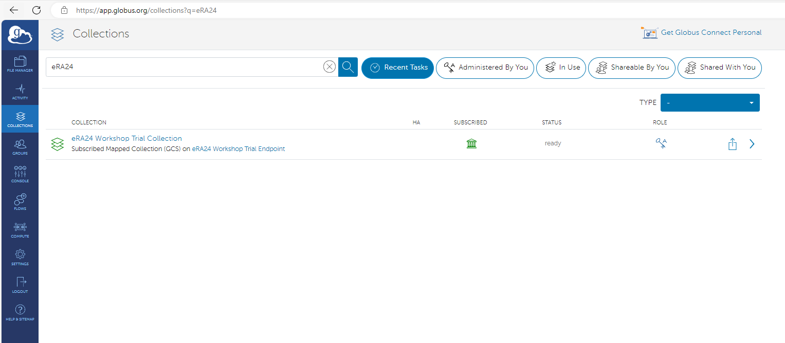

Open the mapped collection.

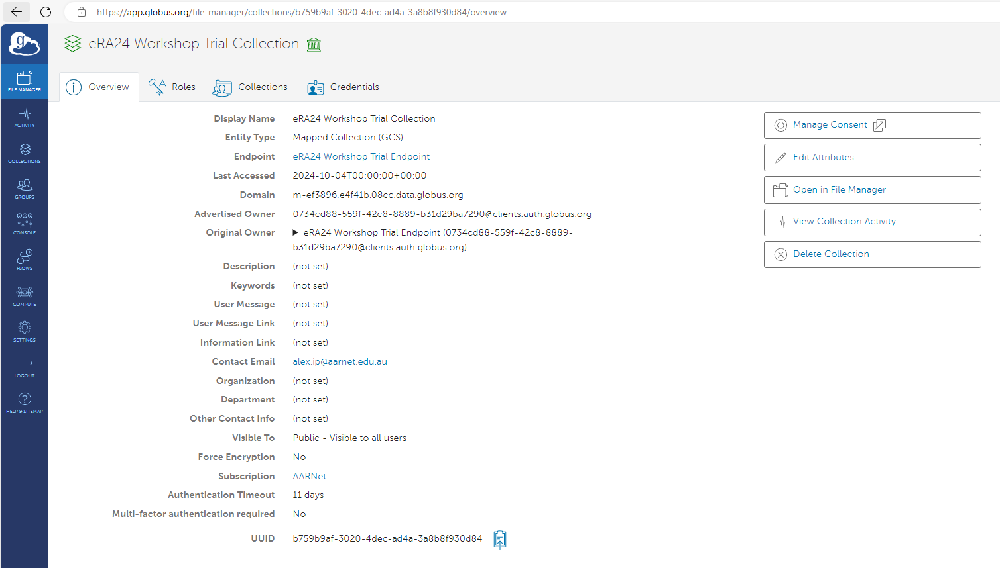

Click on the "Collections" tab at the top.

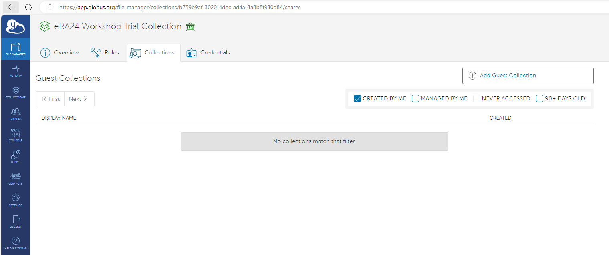

Click on the "Add Guest Collection" button on the top right, then select the subdirectory you wish to share as a guest collection. Fill in any other details.

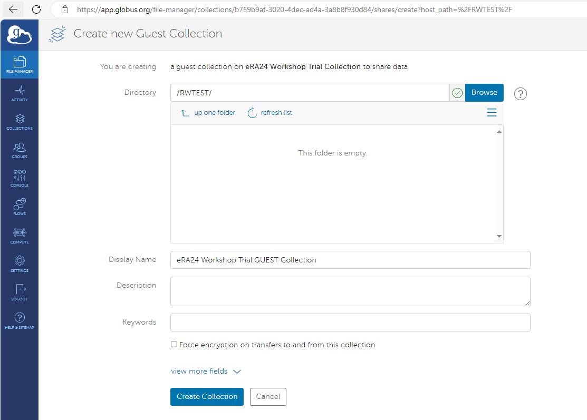

Click on "Create Collection". You will be taken to the permissions page.

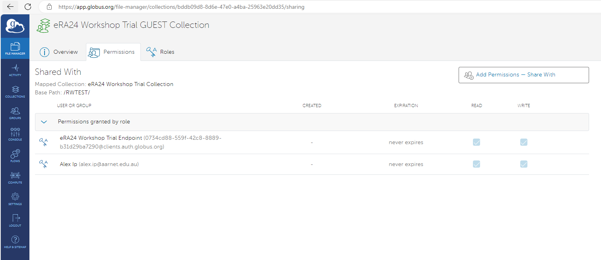

**Congratulations! You have just created a Globus Guest Collection.**

We can now add permissions for arbitrary Globus user accounts as guest users, but we will do this later in the section "Globus User Permissions for Guest Collections" below.

## GLOBUS AUTHENTICATION & SETTING ACCESS PERMISSIONS

### AUTHENTICATION

#### Default Authentication (CILogon)
Globus authentication defaults to using CILogon, which is an international federation of Identity Providers (IDPs). CILogon supports over 5000 identity providers, including campus identity providers, GitHub, Google, Microsoft, and ORCID. Visit [CILogon](https://cilogon.org/) to view the full list of identity providers and to try logging on with your preferred provider.

If your institution is a member of the [Australian Access Federation (AAF)](https://aaf.edu.au/) or [Tuakiri](https://www.reannz.co.nz/products-and-services/tuakiri/), then you most likely have the ability to log in via CILogon by default through [EduGAIN](https://technical.edugain.org/). You may need to ask your institutional IT administration to enable EduGain if it isn't already.

#### Custom Authentication
See [Globus Connect Server v5 Authorization and Authentication](https://docs.globus.org/guides/overviews/security/authorization-authentication-v54/) for a detailed description of the interactions between various components that manage authentication/authorization when a user transfers or shares files using Globus.

Globus can be integrated with your local LDAP or similar authentication mechanism - see [Identity Provider Integration (globus.org)](https://docs.globus.org/guides/overviews/security/identity-provider-integration/) for more details.

This customisation is beyond the scope of this workshop, so please contact AARNet if you are interested in implementing this.

### ACCESS PERMISSIONS
Globus will apply the most restrictive set of permissions from the combination of all of these settings:
1. File and directory permissions for mapped local users
1. Storage Gateway permissions
1. Globus permissions for guest users

This means, for example, that if the local file and directory permissions do not permit reading by the local user, then the items will not be visible to the globus user regardless of the permissiveness of the other settings.

In a production setting, it is best practice to apply the principle of least privilege to your security settings so that you have multiple layers of security.

#### Local Filesystem Permissons
It is important to apply appropriate POSIX (or other filesystem) permissions to your files and directories for local users. For testing (and for this workshop), it may be acceptable to initially apply ```chmod -R 777 <globus directory>```, to allow full read/write access to all users and rely only on the storage gateway and Globus user permissions. However, it would be far better to apply a more restrictive and finely tuned set of permissions to the files and directories, especially in a production environment. Note that Access Control Lists (ACLs) can be used to apply even more finely grained security at the filesystem level.

#### Globus Storage Gateway Permissions
It is possible (and actually recommended) that you restrict permissions on files and directories when configuring the Storage Gateway for an additional of security for access through Globus. Note that we did not apply restrictions at this level in the earlier exercise, so now we will go through adjusting permissions at the Storage Gateway level retrospectively using the "globus-connect-server storage-gateway update" command. Note that we should also restrict access for local users in the filesystem to provide another layer of security as discussed in the previous section.

You should already have a writable data directory called "RWTEST" under your mapped collection directory, and a guest collection set up to use that directory.

We will set out the permissions you would like to apply in a JSON document. The following commands will save this file as ```path-restrictions.json``` in your home directory __(make sure you modify it with your values first!)__:
```
cd ~
cat <<EOF >path-restrictions.json
{
  "DATA_TYPE": "path_restrictions#1.0.0",
  "read": [
    "/home/<your Globus username>/globus_collection"
  ],
  "read_write": [
    "/home/<your Globus username>/globus_collection/RWTEST"
  ],
  "none": [
    "/"
  ]
}
EOF
```

The above JSON denies any access to the root directory (always a good idea), allows read-only access for anything under ```/home/<your Globus username>/globus_collection``` and allows read-write access only to ```/home/<your Globus username>/globus_collection/RWTEST```. Note that these permissions are combined with the Globus permissions and the local file permissions on a least-privilege basis: i.e. if access is denied by one or more of the Storage Gateway permissions, the Globus file permissions or the local file permissions, then the user will be denied access.

We will need to find the UUID of the Storage Gateway we created earlier. We would do this as follows:
```
globus-connect-server storage-gateway list
```
This will show something like the following:
```
Display Name                  | ID                                   | Connector | High Assurance | MFA
----------------------------- | ------------------------------------ | --------- | -------------- | -----
<your gateway name>           | <your gateway UUID>                  | POSIX     | False          | False
```

Now we can retrospectively modify the storage gateway using the JSON file as follows:
```
globus-connect-server storage-gateway update posix --restrict-paths file:path-restrictions.json <your gateway UUID>
```
This should give you a message like the following:
```
Message: Updated Storage Gateway <your gateway UUID>
```
You should now be able to read but be unable to write to ```/home/<your Globus username>/globus_collection```, but you should be able to write to ```/home/<your Globus username>/globus_collection/RWTEST```. Note that any restrictions on the storage gateway apply across all Globus users, and you (as the owner) are currently the only user able to write to the RWTEST subdirectory until we set up a guest collection.

#### Globus User Permissions for Guest Collections (Subscription-only feature)
If we have a Globus subscription associated with the endpoint, we can set permissions on individual directories and files for arbitrary Globus users and groups under Guest Collections. We would do this using the Globus Web Application as follows:

Log into the Globus Web Application and click on "Collections" in the left-hand menu.

Find and click on the Guest Collection we created previously. You should be able to see its attributes, which you are free to edit as you see fit. For this exercise, however, you will need to click on the "Permissions" icon at the top left. Note that you will not see "Permissions" if you accidentally opened your Mapped Collection instead of your guest one.

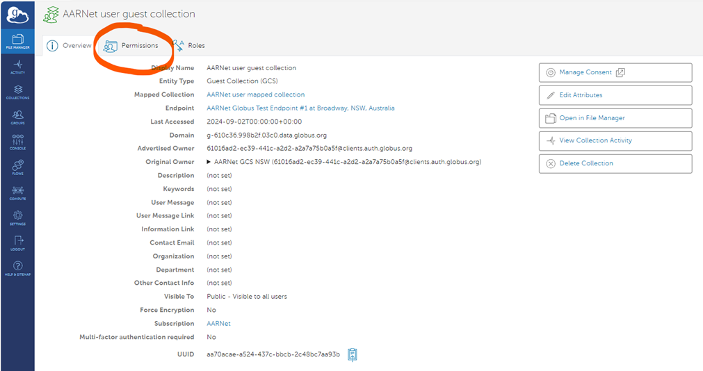

This will open the permissions editing window for your Guest Collection. Note that by default you will have read-write access by role because you own this collection. We will leave that as-is.

Click on the "Add Permissions - Share With" button on the top right.

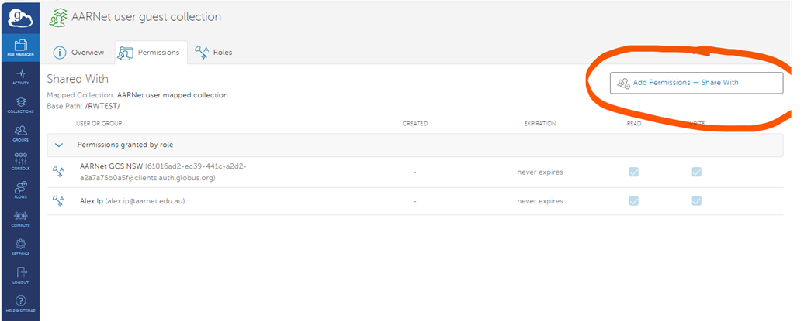

This will bring up the permissions editing window

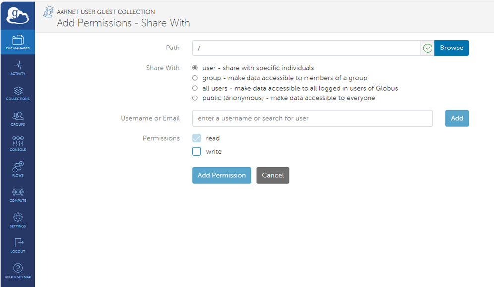

Now in order to allow someone to write to this collection, you will need to do the following

Set the path relative to the guest collection root (```/home/<your Globus username>/globus_collection/RWTEST```). The directory "/" means the whole guest collection, so we can use that.

Ask the person next to you for their Globus login email address. Enter that into the Username field. Note that you could select "all users", but it would be risky allowing anyone to upload to your storage so you would be best to keep this as restrictive as possible.

Check the "write" checkbox to allow the user to upload to the collection.

Click the "Add Permission" button.

Now the specified user will be able to write to your collection just as you can. Try it!

**Congratulations! You have now set up Gobus permission!**

## TRANSFER & TIMER OPTIONS
Globus provides the ability to synchronise folders across endpoints, and also to schedule transfers so that they start at a particular time in the future. To access these controls, you first need to set up the source and destination folders in the file manager, and then click on the "Transfer & Timer Options" button at the top centre of the file manager window.

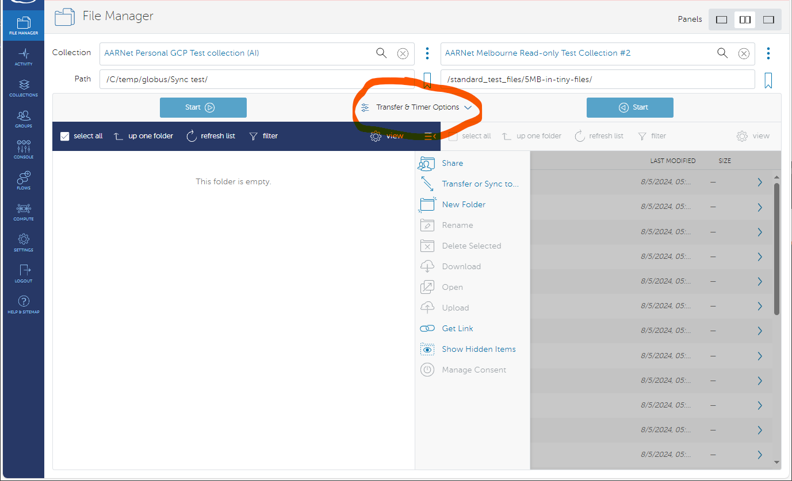

This will bring down a drop-down interface as shown below:

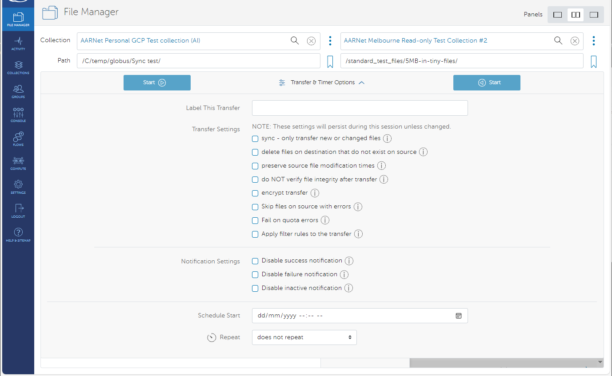

These options should be fairly self-explanatory, but you can click on the "i" icon for each item for more information.

### Scheduling
You can schedule your transfer to start at some time in the future, which can help to minimise the impact on other network users by doing the transfer out of hours. Simply set a date & time in the "Schedule Start" edit box.

### Synchronisation
You can set up Globus to automatically synchronise a folder in order to mirror its contents. To do this, simply check the "sync - only transfer new or changed files" checkbox. This option can be used with a repeat period ranging from 10 minutes to a number of days to keep the mirrored folder up-to-date. Simply click on the "Repeat" edit box to select your time unit (days, hours or minutes), and then enter the number of time units between repeats.

## DECOMMISSIONING
A large part of setting up Globus endpoints, data transfer nodes, storage gateways and collections is registering the entities with Globus so that Globus can manage them. As the entities are created, they are each issued with a unique UUID. Registering endpoints with Globus also involves the creation of a DNS entry and LetsEncrypt certificates.

It is definitely best practice __not__ to simply decommission entities without de-registering them with Globus. It is not the end of the world if you do, but it will leave a number of untidy "zombie" entries that may be visible in the Globus web app until they are removed by Globus support at your request. __It is better if you tidy up yourself in order to avoid the (mild) embarrassment associated with having to involve Globus support.__

Note that you will need to be logged in to your endpoint to perform the decommissioning steps. The final step will require you to re-authenticate with Globus because there will be no Data Transfer Node available to process any operations locally.

We will follow the basic procedure laid out in the Globus documentation [here](https://docs.globus.org/globus-connect-server/v5.4/#decommissioning_an_endpoint) to decommission the resources we have created in the workshop in an orderly way.

### DECOMMISSION ALL COLLECTIONS ON YOUR ENDPOINT
This BASH script will iterate through all collections on your endpoint, remove any delete protection, and delete each one. __Please use this with extreme caution on your own servers - it cannot be undone.__
```
for collection in $(globus-connect-server collection list -F list)
do
  globus-connect-server collection update --no-delete-protected $collection
  globus-connect-server collection delete $collection
done
```
### DECOMMISSION ALL STORAGE GATEWAYS ON YOUR ENDPOINT
This BASH script will iterate through all storage gateways on your endpoint and delete each one. __Please use this with extreme caution on your own servers - it cannot be undone.__
```
for gateway in $(globus-connect-server storage-gateway list -F list)
do
  globus-connect-server storage-gateway delete $gateway
done
```
### DECOMMISSION ALL DATA TRANSFER NODES ON YOUR ENDPOINT
This command will decomission all data transfer nodes on your endpoint. __Please use this with extreme caution on your own servers - it cannot be undone.__
```
sudo globus-connect-server node cleanup
```
### DECOMMISSION YOUR ENDPOINT
Finally, this command will decomission the endpoint itself. Note that you will have to re-authenticate using your browser as instructed. __Please use this with extreme caution on your own servers - it cannot be undone.__
```
globus-connect-server endpoint cleanup
```

__Congratulations! You have successfully decommissioned your Globus endpoint!__

## ADVANCED GLOBUS TOPICS

### GLOBUS FLOWS
Globus Flows provides secure, managed automation of complex workflows at scale. These automations, called flows, are series of actions that can perform common chores—like replicating data across multiple storage systems—as well as complex, bespoke workflows—such as managing multiple conditional data analysis and results distribution operations.

The [Globus Flows overview](https://docs.globus.org/api/flows/overview/) provides an introduction to the key components of this service.

To learn more about how to run and manage flows, check out the [Getting Started guide](https://docs.globus.org/api/flows/getting-started/), which provides step-by-step instructions for using the Globus Web App to start and monitor runs.

See the [Globus Flows documentation](https://docs.globus.org/api/flows/) for more information.

### GLOBUS AUTOMATION
Globus provides a [command-line interface](https://github.com/globus/globus-cli) as well as [Python](https://globus-sdk-python.readthedocs.io/en/stable/) and [JavaScript](https://github.com/globus/globus-sdk-javascript#readme) SDKs, so there is great scope for integration.

A sample [folder watcher script](https://github.com/AARNet/Globus-Community/tree/main/code/examples/folder_watcher) can be found in the Globus Community AU GitHub repo as a small example of basic BASH scripting using the GLobus CLI tools.
